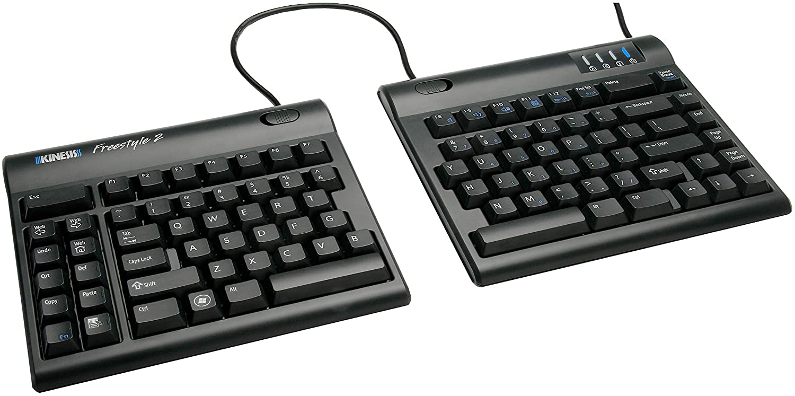

```{r setup, include=FALSE}
library(knitr)
library(fontawesome)
library(tidyverse)
library(metathis)
library(logitr)

options(
  htmltools.dir.version = FALSE,
  knitr.table.format = "html",
  knitr.kable.NA = '',
  dplyr.width = Inf,
  width = 250
)

knitr::opts_chunk$set(
  cache = FALSE,
  warning = FALSE,
  message = FALSE,
  fig.path = "figs/",
  fig.width = 7.252,
  fig.height = 4,
  comment = "#>",
  fig.retina = 3
)

# Setup xaringanExtra options
xaringanExtra::use_xaringan_extra(c(
  "tile_view", "panelset", "share_again"))
xaringanExtra::style_share_again(share_buttons = "none")
xaringanExtra::use_extra_styles(
  hover_code_line = TRUE,
  mute_unhighlighted_code = FALSE
)
xaringanExtra::use_broadcast()
xaringanExtra::use_freezeframe(responsive = FALSE)

# Set up website metadata
meta() %>%
  meta_general(
    description = rmarkdown::metadata$title,
    generator = "xaringan and remark.js"
  ) %>%
  meta_name("github-repo" = "jhelvy/2021-useR-healthy-hands") %>%
  meta_social(
    title = rmarkdown::metadata$title,
    url = "https://jhelvy.com",
    og_type = "website",
    og_author = "John Paul Helveston",
    twitter_card_type = "summary_large_image",
    twitter_creator = "@johnhelveston"
  )

knitr::opts_chunk$set(
    warning = FALSE,
    message = FALSE,
    comment = "#>",
    fig.path = "figs/",
    fig.retina = 3 # Better figure resolution
)
```

layout: true

<!-- this adds the link footer to all slides, depends on my-footer class in css-->

<div class="footer-small">
<span>
https://github.com/jhelvy/2021-useR-healthy-hands
</span>
</div>

---

name: title-slide
class: inverse, middle

# Healthier ❤️ & Happier 😄 Hands 🙌

.leftcol70[
## Software and Hardware Solutions for More Ergonomic Typing

### by John Paul Helveston

### 2021 useR! Conference
]

.rightcol30[
<br><center>

</center>
]

???

Hi everyone, my name is John Paul Helveston and I want to talk

about solutions to keep our hands happy and healthy

---

class: center
background-color: #fff

## **Last year I typed 7.5 million key strokes**

<center>

</center>

???

Last year I typed 7.5 million key strokes, and if you're a

regular R user like me, chances are you too are racking up

some serious mileage on your keyboard, which can lead to pain

and serious injury. So today I want to talk about some tools

and suggestions to take better care of your hands while typing.

---

class: center
background-color: #fff

# Practice Typing

## https://www.keybr.com/

<center>

</center>

???

My first suggestion is simply to practice your typing.

I thought I had pretty good typing skills, but I found I was

able to increase my speed and accuracy by about 20% with just

two months of daily practice on on key-br-dot-com. So, take some

time to work on your typing, most people can benefit from it.

---

class: center
# Master keyboard shortcuts

<br>

.leftcol[
## Insert `<-` with:

## `alt/option` + `-`
]

.rightcol[
## Insert `%>%` with:

## `ctrl/cmd` + `shift` + `M`
]

???

My next suggestion is to master your keyboard shortcuts.

RStudio is packed with excellent shortcuts, like "alt" + "dash"

to create an assignment operator, or command-shift-M to make a pipe.

---

class: center

# Learn shortcuts

.leftcol40[
## Align messy code:

## `Ctrl + I`
]

.rightcol60[
<center>
<blockquote class="twitter-tweet"><p lang="en" dir="ltr">One of my favorite <a href="https://twitter.com/rstudio?ref_src=twsrc%5Etfw">@rstudio</a> shortcuts: Ctrl+I. If your code is misaligned/messy for whatever reason, RStudio will clean it right up for you. <a href="https://twitter.com/hashtag/rstats?src=hash&amp;ref_src=twsrc%5Etfw">#rstats</a> <a href="https://t.co/BzPaPhP9Zl">pic.twitter.com/BzPaPhP9Zl</a></p>&mdash; Kyle Walker (@kyle_e_walker) <a href="https://twitter.com/kyle_e_walker/status/1117801495884386304?ref_src=twsrc%5Etfw">April 15, 2019</a></blockquote> <script async src="https://platform.twitter.com/widgets.js" charset="utf-8"></script>
</center>
]

???

But there are many more that can make you a more efficient coder.

For example, if you want to align a bunch of messy text, just select it

and type control + I.

---

class: center

# Learn shortcuts

.leftcol40[
## Use multiple cursors:

## Hold `Alt/Option` + <br>click & drag 
]

.rightcol60[
<center>
<blockquote class="twitter-tweet"><p lang="en" dir="ltr">Loved the cooking metaphors 🔪🎂 in <a href="https://twitter.com/hadleywickham?ref_src=twsrc%5Etfw">@hadleywickham</a>&#39;s <a href="https://twitter.com/RLadiesSF?ref_src=twsrc%5Etfw">@RLadiesSF</a> talk yesterday! but the best part was watching Hadley speed-code live and learning neat tricks like this: <a href="https://t.co/UVmrPbxpho">pic.twitter.com/UVmrPbxpho</a></p>&mdash; Irene Steves (@i_steves) <a href="https://twitter.com/i_steves/status/995394452821721088?ref_src=twsrc%5Etfw">May 12, 2018</a></blockquote> <script async src="https://platform.twitter.com/widgets.js" charset="utf-8"></script>
</center>
]

???

One of my favorites is to generate multiple cursors by holding the

"alt" key and selecting some lines. This is particularly helpful for

editing elements in a vector.

---

class: center

# Use a text expander

<br>

.leftcol[
<center>

</center>
]

.rightcol[
<center>

</center>
]

<center>
Powered by 
<br>
See my post on espanso at <a href="https://www.jhelvy.com/blog">https://www.jhelvy.com/blog</a>
</center>

???

You can also create your own shortcuts by using a text expander,

which are programs that convert keywords into text snippets.

In the example on the left, I'm using some custom expansions to

write some ggplot code for a scatterplot. And on the right, I'm

using a single keyword to generate a code chunk that I use in most

of my RMarkdown files. My favorite expander is an open source one

called espanso, if you want to learn more at it, you can check out

my blog post about it on my website at jhelvy.com.

---

class: center

# Use custom keyboard layers

.cols3[
## .center[**Base layer**]

<center>
<p style="font-size:40px;">
1234567890
<br>
qwertyuiop
<br>
asdfgjhkl'
<br>
zxcvnm,./
</p>
</center>
]

.cols3[
<br>
<center>

</center>
]

.cols3[
## .center[**Shift layer**]

<center>
<p style="font-size:40px;">
!@#$%^&*()
<br>
QWERTYUIOP
<br>
ASDFGHJKL"
<br>
ZXCVBNM<>?
</p>
</center>
]

???

Another tip is to use custom keyboard layers. Every keyboard has

at least two layers: the base layer of numbers and lower case letters,

and another layer of symbols and upper case letters when you hold "shift".

---

background-color: #fff
class: middle

<center>

</center>

???

Unfortunately, many of the most useful keys for coding, like our navigation

arrows, require us to move our hands away from the home row position.

---

background-color: #fff
class: middle

<center>

</center>

???

A nice solution is to use a custom layer to move these keys back

to a more convenient location.

---

background-color: #fff
class: center

# Example: **Caps Lock Layer**

<center>

</center>

???

For example, on my keyboard, I re-mapped my caps lock key to

trigger a new layer that has the navigation arrows and forward and back

delete under my right hand, and cut, copy, paste under my left hand.

---

class: middle 

<center>
<video width="1000" controls>
  <source src="images/keyboard_nav_demo.mp4" type="video/mp4">
  <source src="images/keyboard_nav_demo.mp4" type="video/ogg">
  Your browser does not support HTML video.
</video>
</center>

???

As you can see in this demo, this enables me quickly move the cursor around

and manipulate code in RStudio without ever needing to leave the home row.

---

class: center, middle

.leftcol[
# Mac 

#### https://karabiner-elements.pqrs.org/

<center>

</center>
]

.rightcol[
# Windows 

#### https://www.autohotkey.com/

<center>

</center>
]

???

I implemented this using a program called Karabiner Elements, which is

for mac only, but on Windows most people use a similar program called

Auto-hot-key.

---

background-color: #fff
class: center

# Use a split keyboard

<center>

</center>

???

In addition to all these software tools, I highly recommend using

some kind of a split keyboard.

---

background-color: #fff
class: center

# Reduce **Ulnar Deviation**

<center>

</center>

???

Split keyboards fix a lot of common ergonomic problems compared to a standard

keyboard, like reducing ulnar deviation from twisting your wrists outward.

---

background-color: #fff
class: center

# Reduce **Forearm Pronation**

<center>

</center>

???

And most split keyboards also add a small tenting angle 

to reduce forearm pronation.

---

background-color: #fff
class: center, middle

# Think of your keyboard as a medical device

<br>

.cols3[
<center>

<br>
KINESIS Freestyle 2<br><b>$89.00</b>
</center>
]

.cols3[
<center>

<br>
Logitech - ERGO K860<br><b>$129.00</b>
</center>
]

.cols3[
<center>

Average cost of glasses<br><b>$242.00</b>
</center>
]

???

Now one of the downsides to split keyboards is that they can be more

expensive, though there are plenty of great options for around $100.

But I encourage to consider your keyboard as a medical device, like a

pair of glasses, which can easily cost over $100. Without glasses,

I couldn't read my own code, but without a keyboard I couldn't type it.

Investing in a good keyboard is an investment in the health of your hands,

wrists, and shoulders.

---

class: center

# Use a split keyboard **_that has thumb keys_**

<center>

<br>
Ergodox EZ (~$350.00)
</center>

???

To really max out the benefits of a split keyboard, consider one that

has dedicated thumb keys, like the Ergodox. Your thumbs are really

strong, and they're useful for way more things than hitting a space bar.

---

class: center

# Build Your Own Keyboard for Less!

<center>

<br>
Iris (~$200.00), Powered by <a href="https://qmk.fm/">QMK Firmware</a>
</center>

???

The Ergodox in particular is rather expensive, but if you're feeling ambitious

you can build your own for a lot less. There's actually a pretty big community

of keyboard hobbiest, and building your own keyboard these days is actually

rather straightforward. Keyboards like the Iris shown here can be snapped

together like a set of legos.

---

background-color: #fff
class: center

# Use a split keyboard **_that is programmable_**

<center>

</center>

???

Finally, if you are going to invest in a good keyboard, get one that is fully

programmable. This enables you to implement many of the solutions I mentioned,

like custom layers, directly into the keyboard itself.

---

class: inverse

.leftcol75[
My Iris Keyboard:

### Slides:<br>https://jhelvy.github.io/2021-useR-healthy-hands

### My Karabiner Elements Settings:<br>https://github.com/jhelvy/jkeyboard

### My Iris Keyboard:<br>https://github.com/jhelvy/iris-rev2
]

.rightcol25[.right[
# .center[.font150[Thanks!]]

# .center[❤️ 😄 🙌]
<br><br><br><br><br>
@JohnHelveston `r fa(name = "twitter", fill = "white")`<br>
@jhelvy `r fa(name = "github", fill = "white")`<br>
@jhelvy `r fa(name = "weixin", fill = "white")`<br>
jhelvy.com `r fa(name = "link", fill = "white")`<br>
jph@gwu.edu `r fa(name = "paper-plane", fill = "white")`
]]

???

Okay, that's all I have. Thanks for listening and I look forward 

to any comments or questions you might have. If you want to learn 

more about anything I mentioned, here are some links, and feel free

to reach out to me directly on Twitter or by email. 
