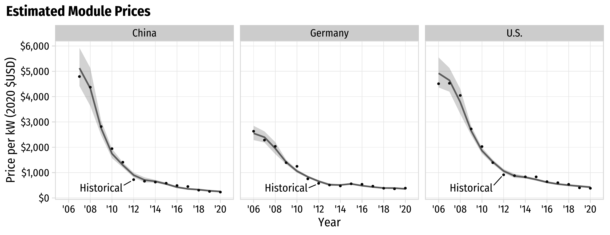

```{r setup, include=FALSE}
library(knitr)
library(fontawesome)
library(tidyverse)
library(metathis)
library(logitr)
library(cbcTools)

options(
    htmltools.dir.version = FALSE,
    knitr.table.format = "html",
    knitr.kable.NA = '',
    dplyr.width = Inf,
    width = 250
)
knitr::opts_chunk$set(
    warning = FALSE,
    message = FALSE,
    fig.path = "figs/",
    fig.width = 7.252,
    fig.height = 4,
    comment = "#>",
    fig.retina = 3
)

# Setup xaringanExtra options
xaringanExtra::use_xaringan_extra(c(
  "tile_view", "panelset", "share_again"))
xaringanExtra::style_share_again(share_buttons = "none")
xaringanExtra::use_extra_styles(
  hover_code_line = TRUE,
  mute_unhighlighted_code = FALSE
)

# Set up website metadata
meta() %>%
  meta_general(
    description = rmarkdown::metadata$subtitle,
    generator = "xaringan and remark.js"
  ) %>%
  meta_name("github-repo" = "jhelvy/2022-isa-conf-solar") %>%
  meta_social(
    title = rmarkdown::metadata$title,
    url = "https://jhelvy.com",
    og_type = "website",
    og_author = "John Paul Helveston",
    twitter_card_type = "summary_large_image",
    twitter_creator = "@johnhelveston"
  )
```

background-image: url("images/climate-bars.png")
background-size: cover

<br><br><br><br><br><br><br><br><br>

.rightcol85[.white[

## `r rmarkdown::metadata$title`

**.white[John Paul Helveston]**, George Washington University<br>
Gang He, Stonybrook University<br>
Michael Davidson, UC San Diego

`r rmarkdown::metadata$date`

]]

---

class: center, middle
background-color: #FFFFFF

## Between 2010 - 2020, global levelized cost of energy (LCOE) of utility-scale solar PV fell by 85%

<center>

</center>

---

class: center, middle
background-color: #FFFFFF

## China's "gift to the world"

<center>

</center>

---

class: center, middle
background-color: #FFFFFF

## China's "gift to the world"

.leftcol60[

<center>

</center>

]

.rightcol40[

China comprises ~70% of global PV manufacturing

.left[
**Response**: 

- **Tariffs** on imported Chinese PV panels (US and EU)
- **Defense Production Act** invoked to accelerate US PV manufacturing (June 2022)
- **Inflation Reduction Act** passes w/incentives for domestic PV manufacturing (July 2022)

]]

---

# .center[Same tensions in every low-carbon technology]

## .center[China is manufacturing leader in almost every sector]

.font120[

Technology | Scale
----|------
Solar Panels | From 1% to 70% (2001 - 2019)
Wind Turbines | 1/3 of global supply (2020)
Electric Vehicles | 51% of global sales (2021)
Lithium-ion Batteries | 70% of global production (76% by 2025)
Nuclear Reactors | From 45 to 88 plants by 2030

]

---

class: middle, center, inverse

# What's the cost of<br>.red[national] versus .blue[global]<br>supply chains?

???

Restricting the free flow of capital, talent, and innovation 

Localizing benefits in terms of growth, employment, and trade surpluses

---

background-color: #FFFFFF

## .center[Learning curve model]

<center>

</center>

---

background-color: #FFFFFF

## .center[Learning curve model]

.leftcol60[

<center>

</center>

]

.rightcol40[

In context of solar PV:

- X: Cumulative installed cap.
- Y: = Price per kW

<br>

Log transformation:

$$\ln Y = \ln a + b \ln X$$

]

---

## Two-factor learning curve model:

<br>

## $$\ln p_{it} = \ln \alpha_i + \beta_i \ln q_{t} + \gamma_i \ln s_{t} + \varepsilon_{it}$$

<br>

## price ($ / kW) = intercept + installed capacity + silicon price

## for country _i_ and year _t_

---

background-color: #fff

<center>

</center>

---

## Two-factor learning curve model:

<br>

## $$\ln p_{it} = \ln \alpha_i + \beta_i \ln q_{t} + \gamma_i \ln s_{t} + \varepsilon_{it}$$

<br>

## Learning rate:

## $$L_i = 1 - 2^{\beta_i}$$

---

class: middle

## .center[Data Sources]
 
Country | Data | Source
--------|-----|----------------
Global | Installed PV capacity and prices | International Renewable Energy Agency (IRENA)
U.S. | Installed capacity | Solar Energy Industries Association (SEIA)
U.S. | Module prices  | Lawrence Berkeley National Laboratory (LBNL) & National Renewable Energy Laboratory (NREL)
China | Installed capacity & module prices | Energy Research Institute (ERI) & China Photovoltaic Industry Association
Germany | Installed capacity | IRENA
Germany | Module prices | Fraunhofer ISE50

All prices are in $2020 USD<br>(inflation adjustments from IMF, exchange rates from Federal Reserve Bank)

---

## Model results

|                                     | United States        | China                | Germany              |
| ----------------------------------- | -------------------- | -------------------- | -------------------- |
|                                     | Est. (Std. Err.)     | Est. (Std. Err.)     | Est. (Std. Err.)     |
| (Intercept)                         | 15 (1.04)\*\*\*      | 18 (1.58)\*\*\*      | 12 (0.96)\*\*\*      |
| log(cum\_capacity\_kw)              | \-0.44 (0.045)\*\*\* | \-0.57 (0.070)\*\*\* | \-0.33 (0.042)\*\*\* |
| log(price\_si)                      | 0.15 (0.058)\*       | 0.23 (0.079)         | 0.21 (0.054)         |

\*p<0.05; \*\*p<0.01; \*\*\*p<0.001

## Learning rates: $L_i = 1 - 2^{\beta_i}$

- U.S.: 26%
- China: 33%
- Germany: 20%

---

class: center, middle
background-color: #FFFFFF

## U.S.: 26%; China: 33%; Germany: 20%
 
<center>

</center>

---

## .center["National Markets" Counterfactual Scenario]

**Assumption**: learning-related price decreases in country _i_ in year _t_ are derived from incrementally more nationally-installed PV capacity

## $$q_t - q_{t-1} = (q_{it} - q_{it-1}) + (1 - \lambda_t) (q_{jt} - q_{jt - 1})$$

## $(q_{it} - q_{it-1})$: Amount installed in country _i_
## $(q_{jt} - q_{jt-1})$: Amount installed in all other countries

---

class: center

## $$q_t - q_{t-1} = (q_{it} - q_{it-1}) + (1 - \lambda_t) (q_{jt} - q_{jt - 1})$$

<br>

.leftcol[

## **Global markets**

$\lambda_t = 0$ 

Capacity from all countries

$$(q_{it} - q_{it-1}) + (q_{jt} - q_{jt - 1})$$

]

.rightcol[

## **National markets**

$\lambda_t = 1$

Capacity only from country _i_

$$(q_{it} - q_{it-1})$$

<br>

$\lambda_t$ -> 1 over 10-year period

]

---

class: middle
background-color: #FFFFFF

<center>

</center>

**Higher prices in 2020**:

- 54% higher in China ($387 versus $250 per kW)
- 83% in higher Germany ($652 versus $357 per kW)
- 107% higher in the U.S. ($877 versus $424 per kW)

---

class: middle, center
background-color: #FFFFFF

## **Total Savings: $67 billion ($50 - $84 billion)**

<center>

</center>

---

class: inverse, middle, center

# Future projections

---

class: center, middle

## Two future projection scenarios out to 2030

.leftcol[

#### National Trends (NT)

| Country | 2030 Target (GW) | Implied CAGR |
| ------- | ---------------- | ------------ |
| U.S.    | 295              | 12%          |
| China   | 750              | 12%          |
| Germany | 103              | 7%           |
| World   | 2,115            | 11%          |

]

.rightcol[

#### Sustainable Development (SD)

| Country | 2030 Target (GW) | Implied CAGR |
| ------- | ---------------- | ------------ |
| U.S.    | 628              | 21%          |
| China   | 1,106            | 17%          |
| Germany | 147              | 11%          |
| World   | 3,125            | 16%          |

(Sustainable Development Scenario in the 2020 IEA World Energy Outlook)

]

---

background-color: #FFFFFF

<center>

</center>

---

## .center[Higher prices in 2030]

.leftcol[

#### .center[National Trends (NT)]

.center[**~20% higher in each country**]

- China: $162 versus $135 per kW
- Germany: $298 versus $251 per kW
- U.S.: $320 versus $262 per kW

]

.rightcol[

#### .center[Sustainable Development (SD)]

.center[**~25% higher in each country**]

- China: $136 versus $108 per kW
- Germany: $276 versus $221 per kW
- U.S.: $276 versus $221 per kW

]

<br>

For comparison, NREL's 2021 Annual Technology Baseline report predicts $170, $190, and $320 / kW by 2030 in advanced, moderate, and conservative improvement scenarios.

---

class: middle, center, inverse

# Sensitivity analysis app

## https://jhelvy.shinyapps.io/solar-learning-2021/

---

class: inverse 
background-image: url("images/climate-bars.png")
background-size: cover

<br><br><br><br><br><br><br><br><br><br>
# Thanks!

### Slides:

### https://github.com/jhelvy/2022-isa-conf-solar

.footer-large[.white[
.right[
@johnhelveston `r fa(name = "twitter", fill = "white")`<br>
@jhelvy `r fa(name = "github", fill = "white")`<br>
@jhelvy `r fa(name = "weixin", fill = "white")`<br>
jhelvy.com `r fa(name = "link", fill = "white")`<br>
jph@gwu.edu `r fa(name = "paper-plane", fill = "white")`

]]]

---

class: center, middle, inverse 

# Extra slides

---

<center>

</center>
