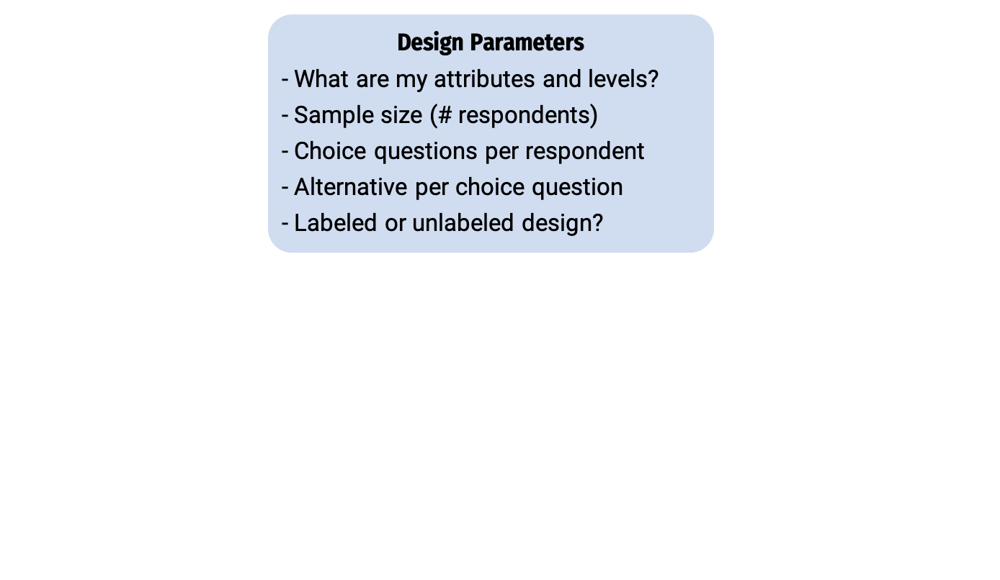
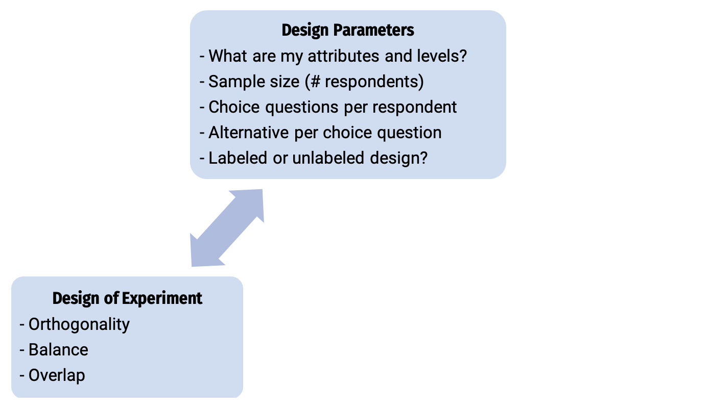
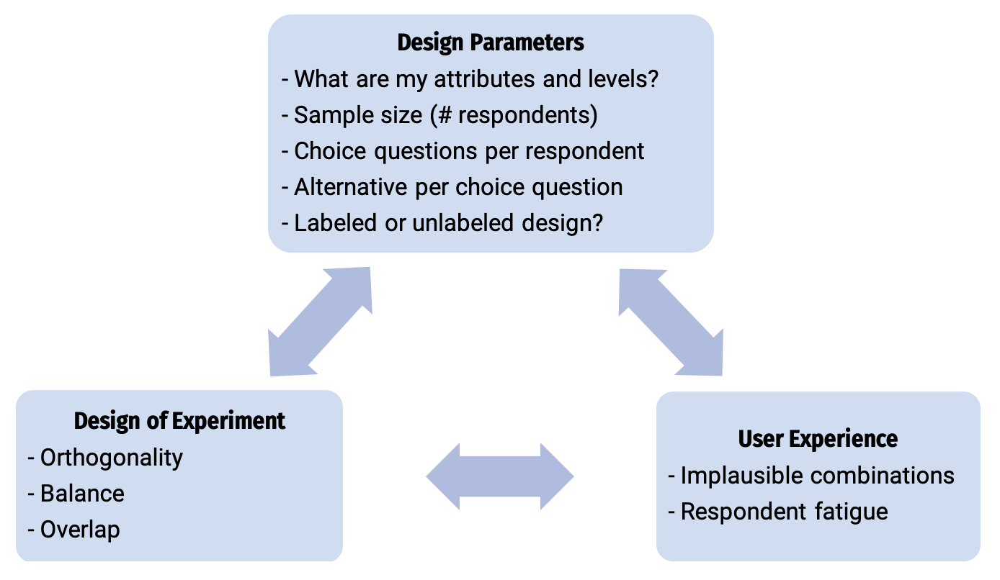
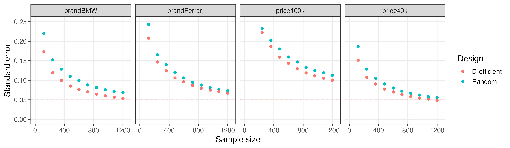
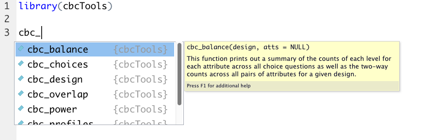

```{r setup, include=FALSE}
library(knitr)
library(fontawesome)
library(tidyverse)
library(metathis)
library(logitr)
library(cbcTools)

options(
    htmltools.dir.version = FALSE,
    knitr.table.format = "html",
    knitr.kable.NA = '',
    dplyr.width = Inf,
    width = 250
)
knitr::opts_chunk$set(
    warning = FALSE,
    message = FALSE,
    fig.path = "figs/",
    fig.width = 7.252,
    fig.height = 4,
    comment = "#>",
    fig.retina = 3
)

# Setup xaringanExtra options
xaringanExtra::use_xaringan_extra(c(
  "tile_view", "panelset", "share_again"))
xaringanExtra::style_share_again(share_buttons = "none")
xaringanExtra::use_extra_styles(
  hover_code_line = TRUE,
  mute_unhighlighted_code = FALSE
)

# Set up website metadata
meta() %>%
  meta_general(
    description = rmarkdown::metadata$subtitle,
    generator = "xaringan and remark.js"
  ) %>%
  meta_name("github-repo" = "jhelvy/2022-sawtooth-conf") %>%
  meta_social(
    title = rmarkdown::metadata$title,
    url = "https://jhelvy.com",
    og_type = "website",
    og_author = "John Paul Helveston",
    twitter_card_type = "summary_large_image",
    twitter_creator = "@johnhelveston"
  )
```

layout: true

<!-- this adds the link footer to all slides, depends on my-footer class in css-->

<div class="footer-small">
<span>
https://github.com/jhelvy/2022-sawtooth-conf
</span>
</div>

---

name: title-slide
class: inverse, middle
background-image: url(images/blue.jpg)

# The `cbcTools` Package <a href='https://jhelvy.github.io/cbcTools/'></a>

## Tools for Designing and Testing<br>Choice-Based Conjoint Surveys in `r fa("r-project", fill = "white")`

### by John Paul Helveston

Sawtooth Software Conference

May 06, 2022

---

class: center

### Designing a Choice-Based Conjoint Survey is Hard

--

<center>

</center>

---

class: center

### Designing a Choice-Based Conjoint Survey is Hard

<center>

</center>

---

class: center

### Designing a Choice-Based Conjoint Survey is Hard

<center>

</center>

---

# .center[A simple conjoint experiment about _cars_]

Attribute | Levels
----------|----------
Brand     | GM, BMW, Ferrari
Price     | $20k, $40k, $100k

.center[**Design: .red[9] choice sets, .blue[3] alternatives each**]

--

.leftcol[

```
Attribute counts:

brand:
  GM   BMW  Ferrari 
  10    11    6 

price:

 20k  40k 100k 
  9    9   9
```

]

--

.rightcol[

```
Pairwise attribute counts:

brand & price:
         
          20k 40k 100k
  GM        3   0    7
  BMW       4   5    2
  Ferrari   2   4    0
```

]

---

# .center[A simple conjoint experiment about _cars_]

Attribute | Levels
----------|----------
Brand     | GM, BMW, Ferrari
Price     | $20k, $40k, $100k

.center[**Design: .red[90] choice sets, .blue[3] alternatives each**]

--

.leftcol[

```
Attribute counts:

brand:
  GM    BMW   Ferrari 
  92    80     98

price:

  20k  40k 100k 
  91   84   95 
```

]

--

.rightcol[

```
Pairwise attribute counts:

brand & price:
         
          20k 40k 100k
  GM      31  31  30
  BMW     25  25  30
  Ferrari 35  28  35
```

]

---

# .center[Bayesian D-efficient designs]

### .center[Maximize information on "Main Effects" according to priors]

Attribute | Levels | Prior
----------|-------------------|----------
Brand     | GM, BMW, Ferrari  | 0, 1, 2
Price     | $20k, $40k, $100k | 0, -1, -4

--

.leftcol[

```
Attribute counts:

brand:
  GM    BMW   Ferrari 
  93    90     86

price:

  20k  40k 100k 
  97   93   78
```

]

--

.rightcol[

```
Pairwise attribute counts:

brand & price:
         
          20k 40k 100k
  GM      52  41  0
  BMW     30  30  30
  Ferrari 15  22  49
```

]

---

# .center[Bayesian D-efficient designs]

### .center[Attempts to maximize information on .red[Main Effects]]

--

<center>

</center>

---

### .center[...but .red[interaction effects] are confounded in D-efficient designs]

--

<center>

</center>

---

# .center[But what about other factors?]

<br>

- What if I add one more choice question to each respondent?

--

- What if I increase the number of alternatives per choice question?

--

- What if I use a labeled design (aka "alternative-specific design")?

--

- What if there are interaction effects?

---

class: middle, center, inverse 

# The `cbcTools` Package 

<center>

</center>

---

background-image: url("images/process.png")

---

background-image: url("images/process_labels.png")

---

class: center, middle 
background-image: url("images/process_labels.png")

.border[
<center>

</center>
]

---

background-image: url("images/process_levels.png")

---

# .center[Define the attributes and levels]

<br>

```{r}
levels <- list(
  price     = c(1.00, 1.50, 2.00, 2.50, 3.00, 3.50, 4.00), # $ per pound
  type      = c("Fuji", "Gala", "Honeycrisp"),
  freshness = c("Excellent", "Average", "Poor")
)
```

--

```{r}
levels
```

---

background-image: url("images/process_profiles.png")

---

# .center[Generate all possible profiles]

<br>

```{r}
profiles <- cbc_profiles(levels)
```

--

.leftcol[

```{r}
head(profiles)
```

]

.rightcol[

```{r}
tail(profiles)
```

]

---

# .center[Attribute-specific levels]

<br>

```{r}
levels <- list(
  price = c(1.00, 1.50, 2.00, 2.50, 3.00, 3.50, 4.00),
  freshness = c("Excellent", "Average", "Poor"),
  type = list(
    "Fuji" = list(
        price = c(2.00, 2.50, 3.00)
    ),
    "Gala" = list(
        price = c(1.00, 1.50, 2.00)
    ),
    "Honeycrisp" = list(
        price = c(2.50, 3.00, 3.50, 4.00),
        freshness = c("Excellent", "Average")
    )
  )
)
```

---

# .center[Generate restricted set of profiles]

<br>

```{r, include = FALSE}
profiles_attspec <- cbc_profiles(levels)
```

```{r, eval=FALSE}
profiles <- cbc_profiles(levels)
```

--

.leftcol[

```{r, eval=FALSE}
head(profiles)
```

```{r, echo=FALSE}
head(profiles_attspec)
```

]

.rightcol[

```{r, eval=FALSE}
tail(profiles)
```

```{r, echo=FALSE}
tail(profiles_attspec)
```

]

---

background-image: url("images/process_design.png")

---

# .center[Generate a survey design]

```{r}
design <- cbc_design( 
  profiles = profiles,
  n_resp   = 300, # Number of respondents
  n_alts   = 3,   # Number of alternatives per question
  n_q      = 6    # Number of questions per respondent
)
```

--

```{r}
head(design)
```

---

# .center[Include a "no choice" option]

```{r}
design <- cbc_design(
  profiles  = profiles,
  n_resp    = 300, # Number of respondents
  n_alts    = 3,   # Number of alternatives per question
  n_q       = 6,    # Number of questions per respondent
  no_choice = TRUE #<<
)
```

--

```{r}
head(design)
```

---

## .center[Make a labeled design]

.center[.font100[(aka "alternative-specific design")]]

```{r}
design <- cbc_design(
  profiles = profiles,
  n_resp   = 300, # Number of respondents
  n_alts   = 3,   # Number of alternatives per question
  n_q      = 6,    # Number of questions per respondent
  label    = "type" #<<
)
```

--

```{r}
head(design)
```

---

# .center[Make a Bayesian D-efficient design]

### .center[(coming soon!)]

```{r, eval=FALSE}
design <- cbc_design(
  profiles = profiles,
  n_resp   = 300, # Number of respondents
  n_alts   = 3,   # Number of alternatives per question
  n_q      = 6,   # Number of questions per respondent
  priors = list( #<< 
    price     = -0.1, #<< 
    type      = c(0.1, 0.2), #<< 
    freshness = c(0.1, -0.2) #<< 
  ) #<< 
)
```

---

# .center[Make a Bayesian D-efficient design]

### .center[(coming soon!)]

<br>

## - Check out the [`idefix`](https://www.jstatsoft.org/article/view/v096i03) package

--

## - Import a design: .blue[Sawtooth] `r fa("arrow-right", fill = "blue")` `r fa("file-csv", fill = "blue")` `r fa("arrow-right", fill = "blue")` `r fa("r-project", fill = "blue")`

---

background-image: url("images/process_inspect.png")

---

# .center[Check design **balance**]

```{r, eval=FALSE}
cbc_balance(design)
```

--

.leftcol[

```
Attribute counts:

price:

      1 1.5   2 2.5   3 3.5   4 
    825 797 743 743 767 779 746 

type:

    Fuji       Gala Honeycrisp 
    1842       1769       1789 

freshness:
  
    Excellent   Average      Poor 
         1813      1775      1812 
```

]

--

.rightcol[

```
Pairwise attribute counts:

price & type:
     
      Fuji Gala Honeycrisp
  1    304  252        269
  1.5  274  251        272
  2    257  254        232
  2.5  240  254        249
  3    249  263        255
  3.5  257  250        272
  4    261  245        240
```

]

---

# .center[Check design **overlap**]

```{r, eval=FALSE}
cbc_overlap(design)
```

--

.leftcol[

```
Counts of attribute overlap:
(# of questions with N unique levels)

price:

     1    2    3 
    31  630 1139 

type:

     1    2    3 
   156 1248  396 

freshness:

     1    2    3 
   175 1189  436 
```

]

---

background-image: url("images/process_choices.png")

---

# .center[Simulate random choices]

```{r}
data <- cbc_choices(
  design = design,
  obsID  = "obsID"
)
```

--

```{r}
head(data)
```

---

# .center[Simulate choices according to a prior]

.leftcol[

```{r}
data <- cbc_choices(
  design = design,
  obsID = "obsID",
  priors = list( #<< 
    price     = -0.1, #<< 
    type      = c(0.1, 0.2), #<< 
    freshness = c(0.1, -0.2) #<< 
  ) #<< 
)
```

]

.rightcol[

Attribute | Level | Utility 
----------|-----------
**Price** | Continuous | -0.1
**Type**  | Fuji | 0
          | Gala | 0.1
          | Honeycrisp  | 0.2
**Freshness**  | Average | 0
               | Excellent | 0.1
               | Poor  | -0.2

]

---

# .center[Simulate choices according to a prior]

.leftcol[

```{r, eval=FALSE}
data <- cbc_choices(
  design = design,
  obsID = "obsID",
  priors = list(  
    price = -0.1, 
    type = randN(  #<<
      mu    = c(0.1, 0.2), #<<
      sigma = c(0.5, 1) #<< 
    ), #<<
    freshness = c(0.1, -0.2) 
  ) 
)
```

]

.rightcol[

Attribute | Level | Utility 
----------|-----------
**Price** | Continuous | -0.1
**Type**  | Fuji | 0
          | Gala | N(0.1, 0.5)
          | Honeycrisp  | N(0.2, 1)
**Freshness**  | Average | 0
               | Excellent | 0.1
               | Poor  | -0.2

]

---

# .center[Simulate choices according to a prior]

.leftcol[

```{r, eval=FALSE}
data <- cbc_choices(
  design = design,
  obsID = "obsID",
  priors = list( 
    price     = -0.1, 
    type      = c(0.1, 0.2), 
    freshness = c(0.1, -0.2),
    "price*type" = c(0.1, 0.5) #<<
  ) 
)
```

]

.rightcol[

Attribute | Level | Utility 
----------|-----------
**Price** | Continuous | -0.1
**Type**  | Fuji | 0
          | Gala | 0.1
          | Honeycrisp  | 0.2
**Freshness**  | Average | 0
               | Excellent | 0.1
               | Poor  | -0.2
**Price x Type**  | Fuji | 0
          | Gala | 0.1
          | Honeycrisp  | 0.5

]

---

background-image: url("images/process_power.png")

---

# .center[Conduct a power analysis]

```{r}
power <- cbc_power(
    nbreaks = 10,
    n_q     = 6,
    data    = data,
    obsID   = "obsID",
    outcome = "choice",
    pars    = c("price", "type", "freshness")
)
```

--

.leftcol[

```{r}
head(power)
```

]

.rightcol[

```{r}
tail(power)
```

]

---

# .center[Conduct a power analysis]

```{r, fig.width=8, fig.height=5}
plot(power)
```

---

# .center[Conduct a power analysis]

.leftcol[

```{r}
power_int <- cbc_power(
    nbreaks = 10,
    n_q     = 6,
    data    = data,
    pars    = c(
      "price", 
      "type", 
      "freshness", 
      "price*type" #<<
    ), 
    outcome = "choice",
    obsID   = "obsID"
)
```

]

.rightcol[

```{r, fig.width=8, fig.height=5}
plot(power_int)
```

]

---

background-image: url("images/process_labels.png")

<center>

</center>

---

background-image: url("images/sawtooth-cbcTools.png")

---

background-color: #fff
background-image: url("images/cbcTools-sawtooth.png")
background-position: center
background-size: contain

---

class: inverse
background-image: url(images/blue.jpg)

<br>

# .center[.font150[Thanks!]]

### `cbcTools` documentation: https://jhelvy.github.io/cbcTools/

### Slides: https://jhelvy.github.io/2022-sawtooth-conf

.footer-large[
.right[
@johnhelveston `r fa(name = "twitter", fill = "white")`<br>
@jhelvy `r fa(name = "github", fill = "white")`<br>
@jhelvy `r fa(name = "weixin", fill = "white")`<br>
jhelvy.com `r fa(name = "link", fill = "white")`<br>
jph@gwu.edu `r fa(name = "paper-plane", fill = "white")`
]]

---

class: center, middle, inverse 

# Extra slides
