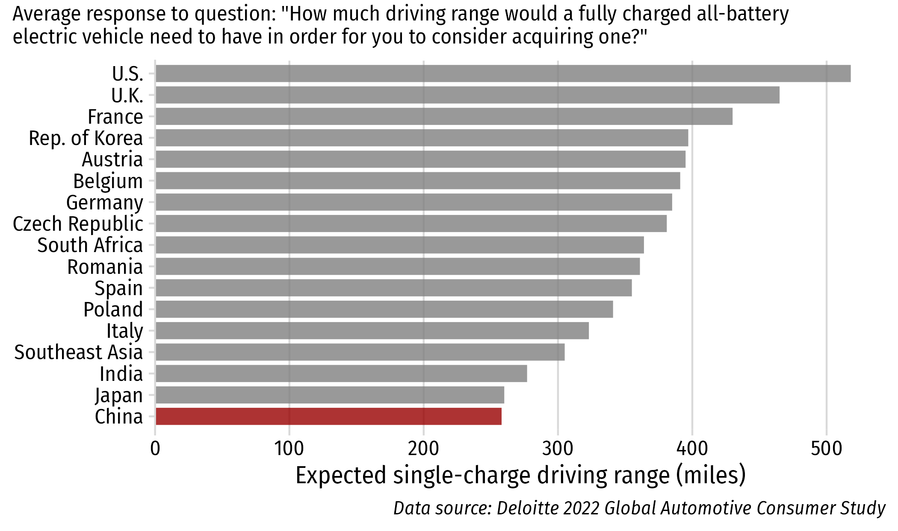
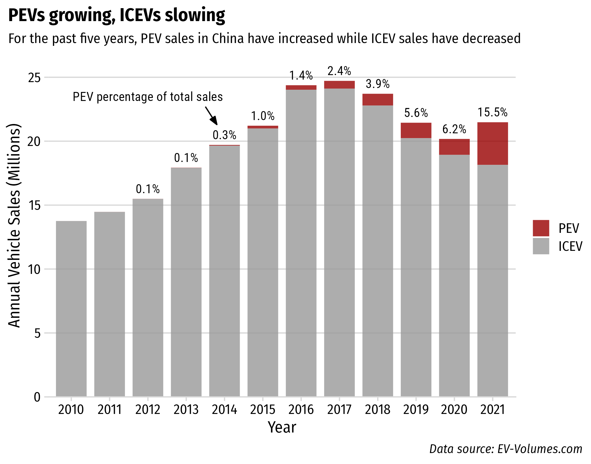

```{r setup, include=FALSE}
library(knitr)
library(fontawesome)
library(metathis)
library(kableExtra)
library(tidyverse)

options(
    htmltools.dir.version = FALSE,
    knitr.table.format = "html",
    knitr.kable.NA = '',
    dplyr.width = Inf,
    width = 250
)
knitr::opts_chunk$set(
    warning = FALSE,
    message = FALSE,
    fig.path = "figs/",
    fig.width = 7.252,
    fig.height = 4,
    comment = "#>",
    fig.retina = 3
)

# Setup xaringanExtra options
xaringanExtra::use_xaringan_extra(c(
  "tile_view", "panelset", "share_again"))
xaringanExtra::style_share_again(share_buttons = "none")
xaringanExtra::use_extra_styles(
  hover_code_line = TRUE,
  mute_unhighlighted_code = FALSE
)

# Set up website metadata
meta() %>%
  meta_general(
    description = rmarkdown::metadata$subtitle,
    generator = "xaringan and remark.js"
  ) %>%
  meta_name("github-repo" = "jhelvy/slides/2022-09-30-ucsd-conf") %>%
  meta_social(
    title = rmarkdown::metadata$title,
    url = "https://slides.jhelvy.com",
    og_type = "website",
    og_author = "John Paul Helveston",
    twitter_card_type = "summary_large_image",
    twitter_creator = "@johnhelveston"
  )
```

name: title-slide
class: inverse, middle
background-size: contain
background-image: url(images/china.png)

.leftcol20[

<center>
<br>

</center>

]

.rightcol80[

## `r rmarkdown::metadata$title`

<br>

### `r rmarkdown::metadata$author`

### `r rmarkdown::metadata$institute`

### `r rmarkdown::metadata$date`

]

---

name: sales
class: center, middle
background-color: #FFF

# Half of global PEV sales are in China

<center>

</center>

---

class: inverse

# China's PEV Ambition

<br>

## - Energy Security
## - Pollution Reduction
## - Technology Leadership

---

background-color: #FFF
class: middle

.leftcol35[

# China's PEV Ambition

<br>

### - .green[Energy Security]
### - Pollution Reduction
### - Technology Leadership

]

.rightcol65[

<center>

</center>

.right[Data source: U.S. EIA: https://www.eia.gov/petroleum/data.phpii]

]

---

background-color: #FFF
class: middle

.leftcol35[

# China's PEV Ambition

<br>

### - Energy Security
### - .green[Pollution Reduction]
### - Technology Leadership

]

.rightcol65[

<center>

</center>

.right[Data source: https://www.globalcarbonatlas.org]

]

---

background-color: #FFF
class: middle

.leftcol35[

# China's PEV Ambition

<br>

### - Energy Security
### - Pollution Reduction
### - .green[Technology Leadership]

]

.rightcol65[

<center>

</center>

]

---

template: sales

---

class: inverse, middle, center

# Institutions

# Market Conditions 

# Policies

---

class: inverse, middle, center

.leftcol[

# .orange[Institutions]

# Market Conditions 

# Policies

]

.rightcol[

<br>

## 1) The Joint Venture System

## 2) Local Protectionism 

]

---

class: center

# The Chinese Joint Venture System

## 1980s: 以市场换技术 = “Exchange market for technology”

--

<center>

</center>

???

Past research suggests system has largely failed to transfer technology

(Brandt & Thun, 2010; Feng, 2010; Howell, 2016; Huang, 2003; Lazonick & Li, 2012; Nam, 2011)

---

class: inverse, middle, center

### “这就像吸食鸦片一样，一旦你沾染上了就永远也无法戒掉。”

何光远, 中国前机械工业部部长

<br>

### “It's like opium. Once you've had it you will be addicted forever.”

Guangyuan He, Former Minister of Machinery and Industry (Reuters, 2012)

---

class: center 

## JV system creates disincentives for<br>industry incumbents to innovate

<br>

.leftcol[

### Multinational OEMs lack incentives to bring cutting-edge technologies

]

.rightcol[

### Chinese JV partners lack incentives to independently innovate

]

---

background-color: #FFF
class: middle, center

### While MNEs dominate global vehicle markets,<br>Chinese firms sell most PEVs in China

<center>

</center>

---

background-color: #FFF
class: middle, center

### While MNEs dominate global vehicle markets,<br>Chinese firms sell most PEVs in China

<center>

</center>

---

background-color: #FFF
class: middle, center

## April 2018: JV requirement dropped for PEVs

<center>

</center>

---

background-color: #EFEFEF
class: center

## Local protectionism incubated early experimentation

.leftcol[

### **Beijing**

Only BEVs exempt from<br>license plate restrictions

<center>

</center>

]

.rightcol[

### **Shanghai**

BEVs & PHEVs exempt from<br>license plate restrictions

<center>

</center>

]

---

class: inverse, middle, center

.leftcol[

# Institutions

# .orange[Market Conditions]

# Policies

]

--

.rightcol[

<br>

## 1) Lower bar for selling PEVs

## 2) Better alternatives to cars

]

---

class: center

## Chinese buyers are more willing to adopt BEVs

.leftcol65[

<center>

</center>

]

.rightcol35[

<br><br><br><br><br>

.left[.font80[Helveston et al. (2015) "Will subsidies drive electric vehicle adoption? Measuring consumer preferences in the U.S. and China" _Transportation Research Part A: Policy and Practice_. 73, 96–112. DOI: [10.1016/j.tra.2015.01.002](https://www.sciencedirect.com/science/article/abs/pii/S0965856415000038)]]

]

---

class: center 

## Chinese buyers are more willing to adopt BEVs

<center>

</center>

---

background-color: #FFF
class: center

## Chinese automakers offer a greater variety of PEVs<br>at more affordable prices and driving ranges

<center>

</center>

---

# .center[Better alternatives to cars]
 
<br>

--

.leftcol[

### .center[World's largest charging network]

- End of 2020, China had 800,000 chargers installed.
- 112,000 chargers installed in December 2020 alone.

]

--

.rightcol[

### .center[World's largest HSR network]

- China's high-speed rail network recently surpassed the length of the equator at just over 40,000 km long

]

---

class: inverse, middle, center

.leftcol[

# Institutions

# Market Conditions

# .orange[Policies]

]

--

.rightcol[

<br>
<br>

## Bigger Sticks & Carrots

]

---

.leftcol[

## .center[Consumers]

- **Purchase Subsidies**:
    - RMB 50,000 (USD $8,200) for PHEVs
    - RMB 60,000 (USD $9,800) for BEVs
- **PEV exemptions from restrictions**
    - Shanghai license plates auction for ~$15,000 (free for PEVs)
    - Unlimited driving during "Rush Hour" (7am – 8pm)

]

--

.rightcol[

## .center[OEMs]

- **Dual Credit System**: require annual credits for meeting fuel economy standards & selling PEVs.
- Tesla earned $1.58 billion from credit sales in 2020<br>(.green[$721 million] profit would have been .red[-$859 million] loss).

]

---

class: middle, center, inverse

# Policies that make ICEVs more expensive<br>than PEVs increase PEV adoption

---

class: inverse, middle

# .center[The Future of China's PEV Industry]

<br>

## 1) What if the JVs break up?

## 2) Will local protectionism hinder growth?

## 3) An Emerging PEV Category: The Mini EV


---

# .center[What if the JVs break up?]

--

.leftcol[

### .center[They probably won't]

- Sunk costs
- Knowledge / IP sharing not a real threat
- Chinese partners can help meet dual credit requirements

]

--

.rightcol[

### .center[Even if they did,<br>not much would change]

- Leading Chinese firms don't have JVs (e.g. BYD, Geely, XPeng, NIO)

]

---

## .center[Will local protectionism hinder growth?]

<br>

--

- Central government cracking down on protectionism strategies

--

- China's PEV market already more competitive than many others.

???

- e-bike comparison: regional clusters supported by local governments were important in the early phases, but establishment of national standards was a critical step for greater industry maturation.
- central government cracking down on most blunt protectionism strategies
- With the entry of Tesla and other successful PEV startups, domestic PEV market is arguably already more competitive than other markets.

---

class: middle

<center>

</center>

---

background-color: #FFF
class: center 

## An Emerging PEV Category: **The Mini EV**

--

.leftcol[

#### Typical Low-speed EV (LSEV)

<center>

</center>

]

--

.rightcol[

#### The Wuling Hongguang Mini EV

<center>

</center>

]

---

## .center[An Emerging PEV Category: **The Mini EV**]

<br>

```{r, echo=FALSE}
read_csv(file.path("data", "ev-types.csv")) %>%
  kbl(
    booktabs = TRUE,
    longtable = FALSE
  ) %>%
  kable_styling(
    latex_options = c("hold_position"),
    font_size = 30
  )
```

---

class: inverse, middle, center

# Institutions

# Market Conditions 

# Policies

---

name: final
class: inverse
background-size: contain
background-image: url(images/china.png)

<br><br><br>

## .center[Slides available at [https://slides.jhelvy.com/](https://slides.jhelvy.com/)]

### .center[© 2022 John Paul Helveston]

.footer-large[
.right[

@johnhelveston `r fa(name = "twitter", fill = "white")`<br>
@jhelvy `r fa(name = "github", fill = "white")`<br>
@jhelvy `r fa(name = "weixin", fill = "white")`<br>
jhelvy.com `r fa(name = "link", fill = "white")`<br>
jph@gwu.edu `r fa(name = "paper-plane", fill = "white")`

]]

---

class: center, middle, inverse 

# Extra slides

---

background-color: #FFF
class: middle, center

<center>

</center>
