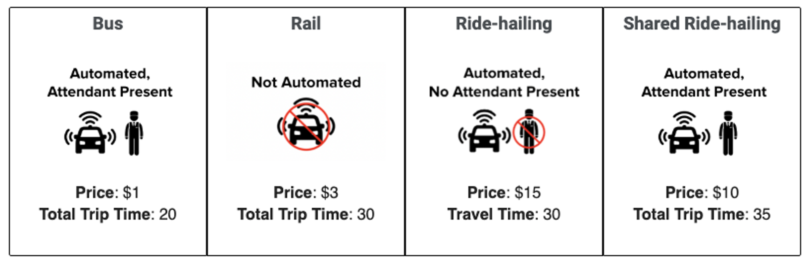
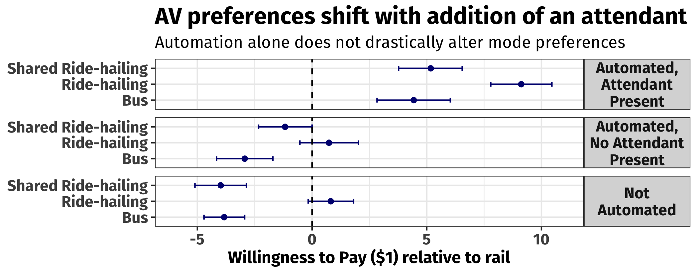
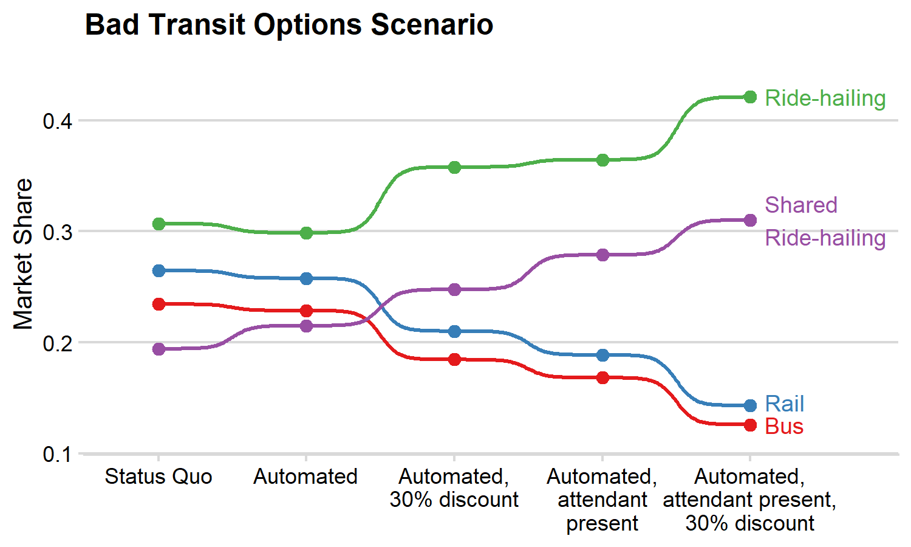
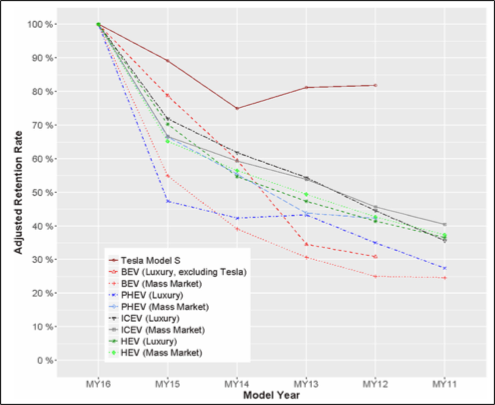
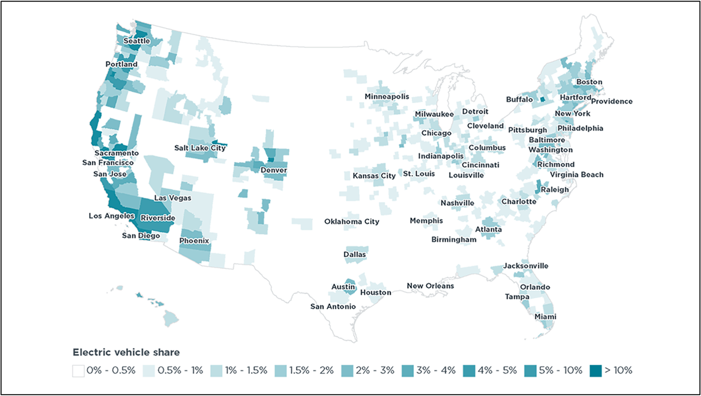
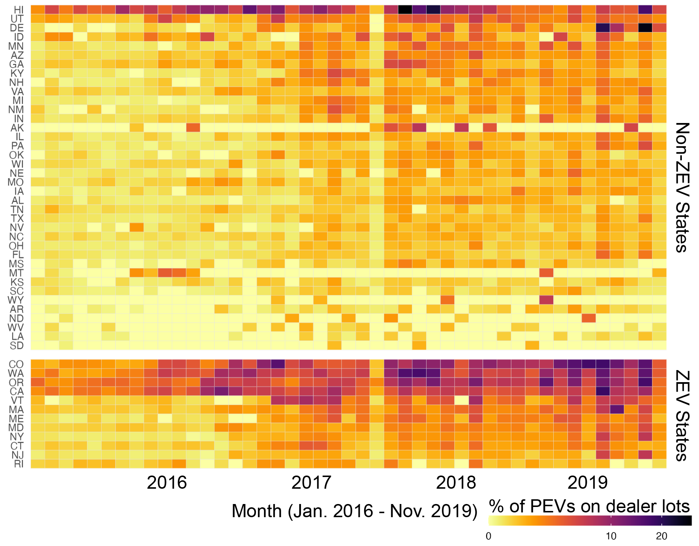
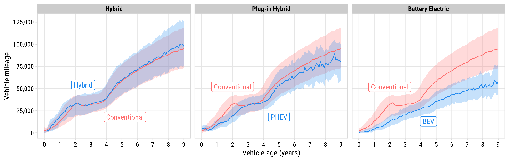

```{r setup, include=FALSE}
library(knitr)
library(tidyverse)
library(fontawesome)
library(metathis)

options(
  htmltools.dir.version = FALSE,
  knitr.table.format = "html",
  knitr.kable.NA = '',
  dplyr.width = Inf,
  width = 250
)

knitr::opts_chunk$set(
  cache = FALSE,
  warning = FALSE,
  message = FALSE,
  fig.path = "figs/",
  fig.width = 7.252,
  fig.height = 4,
  comment = "#>",
  fig.retina = 3
)

# Setup xaringanExtra options
xaringanExtra::use_xaringan_extra(c(
  "tile_view", "panelset", "clipboard", "share_again"))
xaringanExtra::style_share_again(share_buttons = "none")
xaringanExtra::use_extra_styles(
  hover_code_line = TRUE,
  mute_unhighlighted_code = FALSE
)

# Set up website metadata
meta() %>%
  meta_general(
    description = rmarkdown::metadata$subtitle,
    generator = "xaringan and remark.js"
  ) %>%
  meta_name("github-repo" = "jhelvy/research") %>%
  meta_social(
    title = rmarkdown::metadata$title,
    url = "https://jhelvy.github.io/research/",
    og_type = "website",
    og_author = "John Paul Helveston",
    twitter_card_type = "summary_large_image",
    twitter_creator = "@johnhelveston"
  )
```

layout: true

<!-- this adds the link footer to all slides, depends on my-footer class in css-->

<div class="footer-small">
<span> |
<a href="#background">Background</a> |
<a href="#choose">Choice Experiment</a> |
<a href="#cars">Vehicle Listings</a> |
</span>
</div>

---

# .center[`r rmarkdown::metadata$title`]

<br>

.leftcol40[

<center>

</center>

]

.rightcol55[

### `r fontawesome::fa(name = "user", fill = "black")` `r rmarkdown::metadata$author`
### `r fontawesome::fa(name = "university", fill = "black")` `r rmarkdown::metadata$institute`
### `r fontawesome::fa(name = "calendar-alt", fill = "black")` `r rmarkdown::metadata$date`

]

---

name: background

# Hello World!

.leftcol30[.circle[


]]

.rightcol70[

### John Helveston, Ph.D.

.font80[

Assistant Professor, Engineering Management & Systems Engineering

- 2016-2018 Postdoc at [Institute for Sustainable Energy](https://www.bu.edu/ise/), Boston University
- 2016 PhD in Engineering & Public Policy at Carnegie Mellon University
- 2015 MS in Engineering & Public Policy at Carnegie Mellon University
- 2010 BS in Engineering Science & Mechanics at Virginia Tech
- Website: [www.jhelvy.com](http://www.jhelvy.com/)

]]

---

class: center

## Technology Change Lab 

> I study how consumers, firms, markets, and policy affect technological change, with a focus on accelerating the transition to low-carbon technologies

.cols3[

### .center[Electric & Sustainable Vehicle Technologies]

<center>

</center>

]

.cols3[

### .center[Market & Policy Analysis]

<center>

</center>

]

.cols3[

### .center[U.S. - China Climate Relationship]

<center>

</center>

]

---

class: center
background-color: #fff 

# What is Data Analytics? 

.font120[The science of analyzing raw data to draw out<br>**meaningful & actionable insights** to **inform decision-making**]

--

<center>

</center>

Image from https://r4ds.hadley.nz/

---

class: center

# Data analytics in my lab

.leftcol[

## Choice Experiments 

<center>

</center>

]

.rightcol[

## Historical Data

<center>

</center>

]

---

background-color: #000
class: center, middle, inverse

# How do you know what people want?

<center>

</center>

---

name: choose
class: center, middle

## Which feature do you care more about?

<center>

</center>

.cols3[
## .center[Battery Life?]
<center>

</center>
]

.cols3[
## .center[Brand?]
<center>

</center>
]

.cols3[
## .center[Signal quality?]
<center>

</center>
]

---

class: center

## **Conjoint Analysis**:
## Use choice data to model preferences

<center>

</center>

---

name: av
class: inverse

# Undercutting Transit?

## Exploring potential competition between autonomous vehicles and public transportation in the U.S.

<br>

John P. Helveston, Assistant Professor, EMSE

Leah Kaplan, Ph.D. Student, EMSE

---

background-color: #fff
class: middle, center

## Imagine you are going out for an evening leisure activity - <br> Which transportation option would you choose?

<center>

</center>

---

background-color: #fff
class: center, middle

<center>

</center>

---

background-color: #fff
class: center, middle

<center>

</center>

---

name: cars
class: middle, inverse 

# .center[Analyzing historical vehicle listings data]

.leftcol[

<center>

</center>

]

.rightcol[

- New and used cars from 2016-2022
- ~66,000 dealerships

Powertrain | Listings 
-----------|-----------
Gasoline   | 64,573,536
Hybrid | 1,115,208
Battery Electric (BEV) | 301,713
Plug-In Hybrid (PHEV) | 198,129

]

---

# .center[Estimating residual value of EVs]

.leftcol30[

John P. Helveston, Assistant Professor, EMSE

Laura Roberson, Ph.D. Student, EMSE

]

.rightcol70[

<center>

</center>

]

---

# .center[Where are the EVs?]

.leftcol30[

John P. Helveston, Assistant Professor, EMSE

Kazi Asifa, Undergraduate Student, EMSE

]

.rightcol70[

<center>

</center>

]

---

### .center[EVs are disproportionately supplied to ZEV states]

<center>

</center>

---

background-color: #fff

## .center[Do EV owners drive as much as gasoline car owners?]

John P. Helveston, Assistant Professor, EMSE <br>
Lujin Zhao, Ph.D. Student, EMSE <br>
Eliese Ottinger, Undergraduate Student, EMSE

<center>

</center>

---

class: inverse

<br>

# .center[.font150[Thanks!]]

### MS in Data Analytics Program:<br>https://emse.engineering.gwu.edu/ms-data-analytics

### Dr. Helveston's Lab:<br>https://jhelvy.com/


.footer-large[

.right[

@JohnHelveston `r fa(name = "twitter", fill = "white")`<br>
@jhelvy `r fa(name = "github", fill = "white")`<br>
@jhelvy `r fa(name = "weixin", fill = "white")`<br>
jhelvy.com `r fa(name = "link", fill = "white")`<br>
jph@gwu.edu `r fa(name = "paper-plane", fill = "white")`

]]
