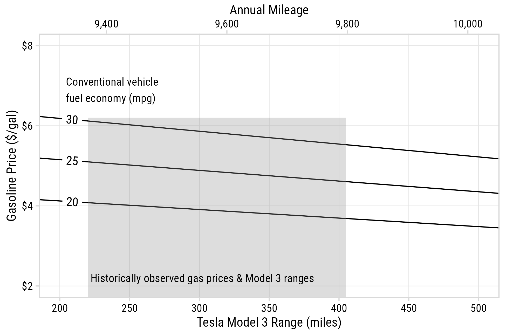

```{r setup, include=FALSE}
library(knitr)
library(fontawesome)
library(tidyverse)
library(metathis)
library(logitr)
library(cbcTools)

options(
    htmltools.dir.version = FALSE,
    knitr.table.format = "html",
    knitr.kable.NA = '',
    dplyr.width = Inf,
    width = 250
)
knitr::opts_chunk$set(
    warning = FALSE,
    message = FALSE,
    fig.path = "figs/",
    fig.width = 7.252,
    fig.height = 4,
    comment = "#>",
    fig.retina = 3
)

# Setup xaringanExtra options
xaringanExtra::use_xaringan_extra(c(
  "tile_view", "panelset", "share_again"))
xaringanExtra::style_share_again(share_buttons = "none")
xaringanExtra::use_extra_styles(
  hover_code_line = TRUE,
  mute_unhighlighted_code = FALSE
)

# Set up website metadata
meta() %>%
  meta_general(
    description = rmarkdown::metadata$subtitle,
    generator = "xaringan and remark.js"
  ) %>%
  meta_name("github-repo" = "jhelvy/slides") %>%
  meta_social(
    title = rmarkdown::metadata$title,
    url = "https://slides.jhelvy.com",
    og_type = "website",
    og_author = "John Paul Helveston",
    twitter_card_type = "summary_large_image",
    twitter_creator = "@johnhelveston"
  )
```

background-image: url("images/blue.jpg")
background-size: cover
class: inverse

<br><br><br><br>

## `r rmarkdown::metadata$title`

**.white[John Paul Helveston]**, George Washington University<br>
Eliese Ottinger, George Washington University<br>
Lujin Zhao, George Washington University<br>
Laura Roberson, George Washington University

`r rmarkdown::metadata$date`

---

class: middle
background-color: #fff

## .center[.font90[Electrifying the passenger vehicle fleet is a critical climate goal]]

<center>

</center>

---

# .center[Two Studies, One Dataset]

.leftcol[

### Measuring Electric Vehicle **Mileage** in the United States

Lujin Zhao (Ph.D. Student)<br>
Eliese Ottinger (Undergraduate RA)<br>


**Status**: Paper submitted for review soon

]

.rightcol[

### Measuring Electric Vehicle<br>**Resale Value** in the United States

Laura Roberson (Ph.D. Student)<br><br>

**Status**: Exploratory phase

]

---

class: middle, inverse

### Going the Distance:<br>Quantifying Electric Vehicle Mileage in the United States

Lujin Zhao (Ph.D. Student)<br>
Eliese Ottinger (Undergraduate RA)<br>
John Paul Helveston, Ph.D.

---

background-image: url("images/table-lit1.png")
background-size: cover

### .center[Conflicting prior results on BEV mileage]

---

background-image: url("images/table-lit2.png")
background-size: cover

### .center[Conflicting prior results on BEV mileage]

---

background-image: url("images/table-lit3.png")
background-size: cover

### .center[Inconsistent data quality in prior studies]

---

background-color: #fff

### .center[**Data**: ~13M used vehicle listings from 60k dealerships (2016 - 2022)]

<center>

</center>

---

class: center
background-color: #fff

## BEVs are driven significantly less than other powertrains

<center>

</center>

---

background-color: #fff

.leftcol80[

<center>

</center>

]

.rightcol20[

### BEVs driven ~4,000 miles less than CVs on average

]

---

background-color: #fff

.leftcol70[

<center>

</center>

]

.rightcol30[

### BEVs driven ~4,000 miles less than CVs on average

]

---

background-color: #fff
class: center

### Teslas driven more than non-Tesla BEVs

<center>

</center>

---

background-color: #fff

<center>

</center>

---

background-color: #fff

<center>

<br>

</center>

---

background-color: #fff

<center>

</center>

---

class: middle, inverse

### Measuring Electric Vehicle Resale Value in the United States

Laura Roberson (Ph.D. Student)<br>
John Paul Helveston, Ph.D.

---

background-color: #fff
class: center 

## The vehicle resale market is critically important<br>(and heavily under-studied)

--

.leftcol[

## ~2.5x size of the new market

<center>

</center>

]

--

.rightcol[

## More affordable (pre-covid)

<center>

</center>

]

---

# .center[We really need to understand PEV resale value]

### - Depreciation is a key component in "Total Cost of Ownership" (TCO) models, e.g. [ANL's TCO Study](https://publications.anl.gov/anlpubs/2021/05/167399.pdf)

--

### - "Resale anxiety" a potential obstacle to electric vehicle adoption [Brückmann et al. (2021)](https://doi.org/10.1088/1748-9326/ac3531)

--

### - BEV buyers nervous about depreciation tend to lease rather than buy [Dua et al. (2019)](https://www.sciencedirect.com/science/article/pii/S235248471930068X)

---

background-color: #fff

## .center[PEVs are depreciating faster than CVs and HEVs]

<center>

</center>

---

class: middle, center
background-color: #fff

.leftcol[

## $\frac{Price}{MSRP}$

<center>

</center>

]

--

.rightcol[

## $\frac{Price}{MSRP - Subsidy}$

<center>

</center>

]


---

class: inverse 
background-image: url("images/blue.jpg")
background-size: cover

<br><br><br><br><br><br><br><br><br><br>

# Thanks!

### Slides:

### https://slides.jhelvy.com/2023-isa-conf/

.footer-large[.white[.right[

@jhelvy@fediscience.org `r fa(name = "mastodon", fill = "white")`<br>
@JohnHelveston `r fa(name = "twitter", fill = "white")`<br>
@jhelvy `r fa(name = "github", fill = "white")`<br>
jhelvy.com `r fa(name = "link", fill = "white")`<br>
jph@gwu.edu `r fa(name = "paper-plane", fill = "white")`

]]]

---

class: center, middle, inverse 

# Extra slides

