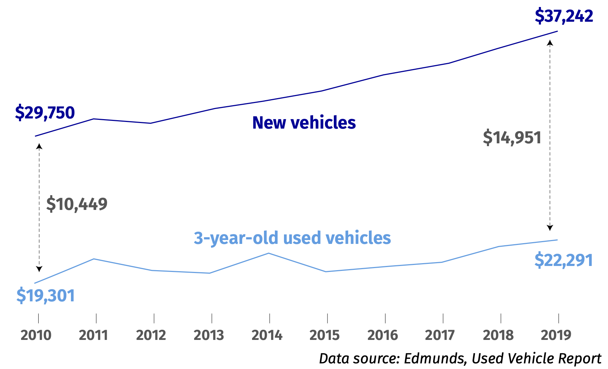
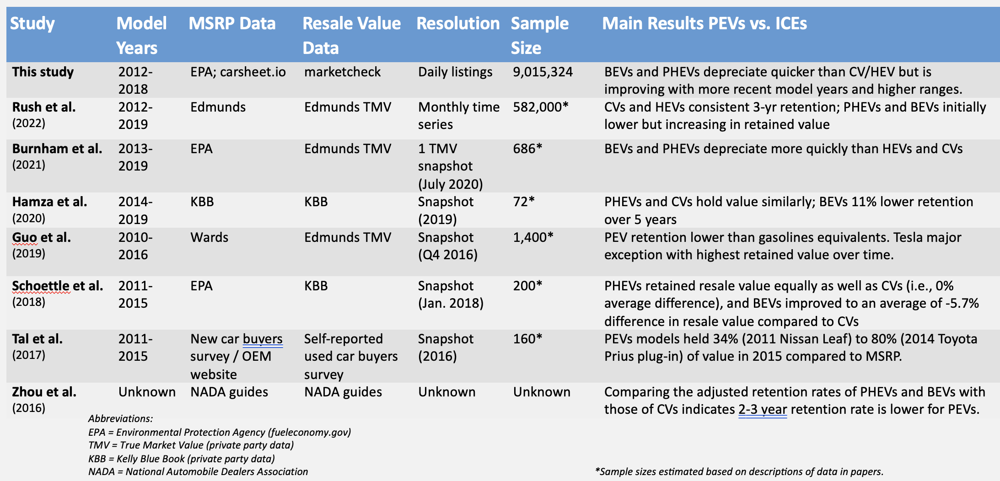
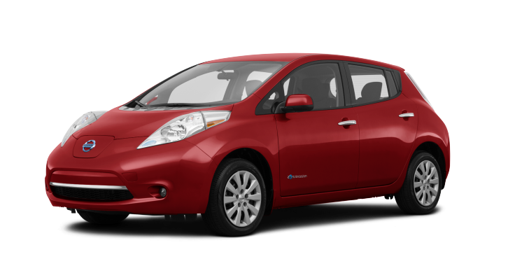
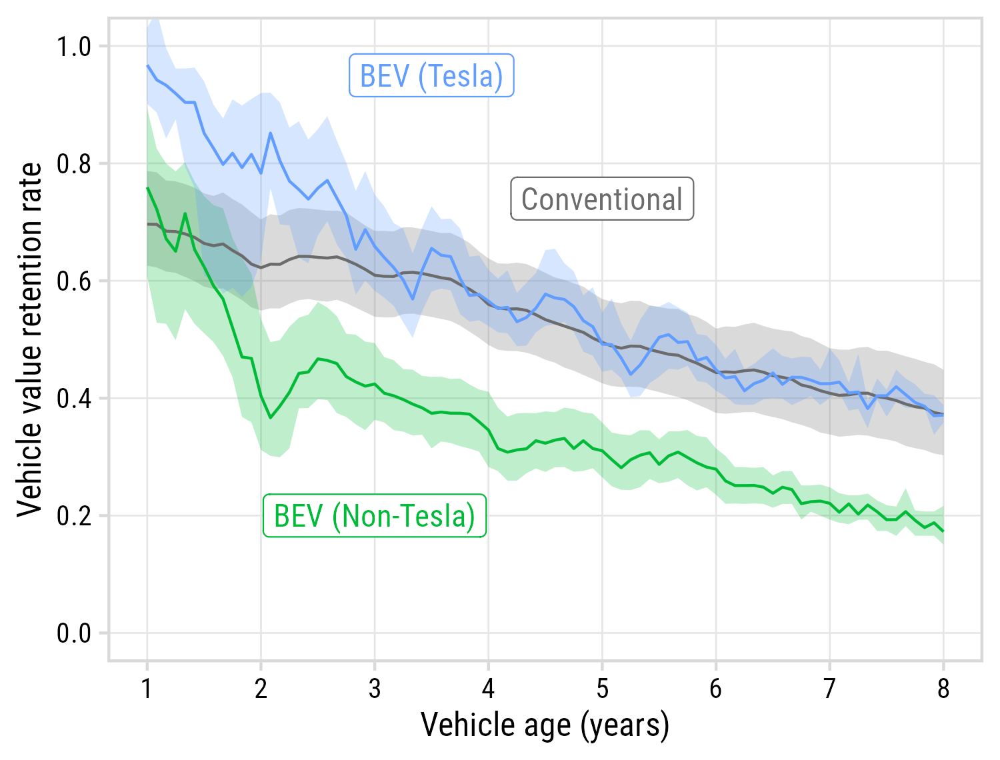
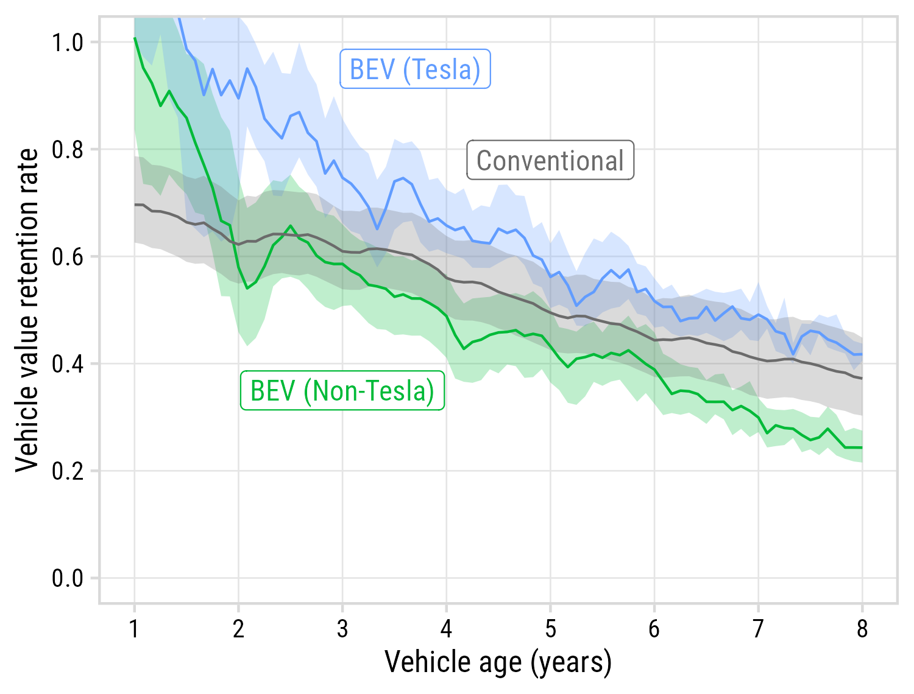

```{r setup, include=FALSE}
library(knitr)
library(fontawesome)
library(tidyverse)
library(metathis)

options(
    htmltools.dir.version = FALSE,
    knitr.table.format = "html",
    knitr.kable.NA = '',
    dplyr.width = Inf,
    width = 250
)
knitr::opts_chunk$set(
    warning = FALSE,
    message = FALSE,
    fig.path = "figs/",
    fig.width = 7.252,
    fig.height = 4,
    comment = "#>",
    fig.retina = 3
)

# Setup xaringanExtra options
xaringanExtra::use_xaringan_extra(c(
  "tile_view", "panelset", "share_again"))
xaringanExtra::style_share_again(share_buttons = "none")
xaringanExtra::use_extra_styles(
  hover_code_line = TRUE,
  mute_unhighlighted_code = FALSE
)

# Set up website metadata
meta() %>%
  meta_general(
    description = rmarkdown::metadata$subtitle,
    generator = "xaringan and remark.js"
  ) %>%
  meta_name("github-repo" = "jhelvy/slides") %>%
  meta_social(
    title = rmarkdown::metadata$title,
    url = "https://slides.jhelvy.com",
    og_type = "website",
    og_author = "John Paul Helveston",
    twitter_card_type = "summary_large_image",
    twitter_creator = "@johnhelveston"
  )
```

background-image: url("images/blue.jpg")
background-size: cover
class: inverse

<br><br><br><br>

## `r rmarkdown::metadata$title`

Laura Roberson, George Washington University<br>
Saurav Pantha, George Washington University<br>
**.white[John Paul Helveston]**, George Washington University

`r rmarkdown::metadata$date`

---

background-color: #fff
class: center 

## The vehicle resale market is critically important

--

.leftcol[

## 70% of sales are<br>used vehicles

<center>

</center>

]

--

.rightcol[

## Used vehicles are more affordable (pre-covid)

<center>

</center>

]

---

# .center[We really need to understand PEV resale value]

--

<br>

### - Depreciation is a key component in "Total Cost of Ownership" (TCO) models, e.g. [ANL's TCO Study](https://publications.anl.gov/anlpubs/2021/05/167399.pdf)

--

### - "Resale anxiety" a potential obstacle to electric vehicle adoption [Brückmann et al. (2021)](https://doi.org/10.1088/1748-9326/ac3531)

--

### - BEV buyers nervous about depreciation tend to lease rather than buy [Dua et al. (2019)](https://www.sciencedirect.com/science/article/pii/S235248471930068X)

---

background-color: #fff

## Prior research suggests PEVs depreciate faster than CVs

<center>

</center>

---

background-color: #fff

### .center[**Data**: ~9M used vehicle listings from 60k dealerships (2016 - 2020)]

<center>

</center>

---

# .center[Two Studies, One Dataset]

.leftcol[

### Measuring Electric Vehicle<br>**Mileage** in the United States

Zhao, L., Ottinger, E., Yip, A., & Helveston, J.P. (2023) ["Quantifying electric vehicle mileage in the United States"](https://www.sciencedirect.com/science/article/abs/pii/S254243512300404X) _Joule_. 7, 1–15.

<center>

</center>

]

.rightcol[

### Measuring Electric Vehicle<br>**Resale Value** in the United States

Roberson, Laura A., Pantha, S., & Helveston, J.P. (2024) “[Battery-Powered Bargains? Assessing Electric Vehicle Resale Value in the United States](https://iopscience.iop.org/article/10.1088/1748-9326/ad3fce)” _Environmental Research Letters_.

<center>

</center>

]

---

class: middle, center
background-color: #fff

# Value Retention Rate:

# $r = \frac{Listing Price}{MSRP}$

---

class: center
background-color: #fff

## BEVs & PHEVs are depreciating worse than CVs and HEVs

### (Except .blue[Tesla])

<center>

</center>

Data: All listings between 2016 - 2019 (inclusive)

---

# Modeling retention rate as exponential decay

<center>

</center>

---

background-color: #fff

<center>

</center>

---

background-color: #fff
class:center 

## Newer PEVs are holding value better than older PEVs<br>(except Tesla)

<center>

</center>

---

background-color: #fff
class:center

## Newer PEVs are holding value better than older PEVs<br>(except Tesla)

<center>

</center>

---

background-color: #fff
class:center 

.leftcol25[

<br>

## Longer-range BEVs hold value better (w/diminishing returns at 200+ miles)

]

.rightcol75[

<center>

</center>

]

---

class: center

## PEV subsidies for new cars should impact used car pricing

--

.leftcol[

### New Market

(MSRP - Subsidy = Price)<br>
$30,000 - $7,500 = **$22,500**

<center>

</center>

<br><br>
.font70[.left[Image source: https://www.pngwing.com/en/free-png-yaftj]]

]

--

.rightcol[

### Used Market

(Assuming adequate supply)<br>
Max Price = **$22,500**

<center>

</center>

]

---

background-color: #fff
class:center 

.leftcol25[

<br>

## Used EVs gain additional benefit from new vehicle subsidies with no additional cost to gov’t

]

.rightcol75[

<center>

</center>

]

---

background-color: #fff
class:center 

.leftcol80[

<center>

</center>

]

.rightcol20[

### COVID-19 had substantial impact on used vehicle pricing

]

---

## Key takeaways

--

### - BEVs have depreciated faster than CVs, but this is changing!

--

### - Newer model BEVs with higher ranges are holding their value more similarly to CVs. 

--

### - Subsidies for new BEVs pass ~3% lower prices in used market

--

### - Post COVID19 pandemic used prices are up ~40% 

---

class: inverse 
background-image: url("images/blue.jpg")
background-size: cover

<br><br><br><br><br><br><br><br><br><br>

# Thanks!

### Slides:

### https://slides.jhelvy.com/2024-btr6/

.footer-large[.white[.right[

@jhelvy@fediscience.org `r fa(name = "mastodon", fill = "white")`<br>
@JohnHelveston `r fa(name = "twitter", fill = "white")`<br>
@jhelvy `r fa(name = "github", fill = "white")`<br>
jhelvy.com `r fa(name = "link", fill = "white")`<br>
jph@gwu.edu `r fa(name = "paper-plane", fill = "white")`

]]]

---

class: center, middle, inverse 

# Extra slides

---

class: middle, center
background-color: #fff

### How you compute retention rate matters

--

.leftcol[

### We omit subsidies: $\frac{Price}{MSRP}$

<center>

</center>

]

--

.rightcol[

### Others: $\frac{Price}{MSRP - Subsidy}$

<center>

</center>

]

---

background-color: #fff

### .center[**Data**: ~9M used vehicle listings from 60k dealerships (2016 - 2020)]

<center>

</center>

---

background-color: #fff
class:center

## Newer BEVs are holding value better than older BEVs 

<center>

</center>
