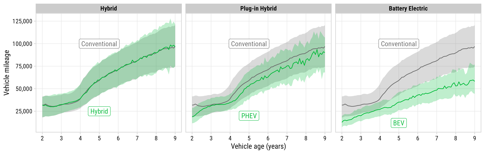

```{r setup, include=FALSE}
library(knitr)
library(fontawesome)
library(tidyverse)
library(metathis)
library(logitr)
library(cbcTools)

options(
    htmltools.dir.version = FALSE,
    knitr.table.format = "html",
    knitr.kable.NA = '',
    dplyr.width = Inf,
    width = 250
)
knitr::opts_chunk$set(
    warning = FALSE,
    message = FALSE,
    fig.path = "figs/",
    fig.width = 7.252,
    fig.height = 4,
    comment = "#>",
    fig.retina = 3
)

# Setup xaringanExtra options
xaringanExtra::use_xaringan_extra(c(
  "tile_view", "panelset", "share_again"))
xaringanExtra::style_share_again(share_buttons = "none")
xaringanExtra::use_extra_styles(
  hover_code_line = TRUE,
  mute_unhighlighted_code = FALSE
)

# Set up website metadata
meta() %>%
  meta_general(
    description = rmarkdown::metadata$subtitle,
    generator = "xaringan and remark.js"
  ) %>%
  meta_name("github-repo" = "jhelvy/slides") %>%
  meta_social(
    title = rmarkdown::metadata$title,
    url = "https://slides.jhelvy.com",
    og_type = "website",
    og_author = "John Paul Helveston",
    twitter_card_type = "summary_large_image",
    twitter_creator = "@johnhelveston"
  )
```

background-image: url("images/blue.jpg")
background-size: cover
class: inverse

<br><br><br><br>

## `r rmarkdown::metadata$title`

**.white[John Paul Helveston]**, George Washington University<br>
Eliese Ottinger, George Washington University<br>
Lujin Zhao, George Washington University<br>

`r rmarkdown::metadata$date`

---

class: middle
background-color: #fff

### .center[.font90[Electrifying the passenger vehicle fleet is a critical climate goal]]

<center>

</center>

---

# .center[Two Studies, One Dataset]

.leftcol[

### Measuring Electric Vehicle<br>**Mileage** in the United States

Lujin Zhao (Ph.D. Student)<br>
Eliese Ottinger (Undergraduate RA)<br>


**Status**: Published in _Joule_

]

.rightcol[

### Measuring Electric Vehicle<br>**Resale Value** in the United States

Laura Roberson (Ph.D. Student)<br>
Saurav Pantha (Former Graduate RA)<br>

**Status**: Submitting soon

]

---

background-color: #fff

### .center[**Data**: ~13M used vehicle listings from 60k dealerships (2016 - 2022)]

<center>

</center>

---

class: middle, inverse

## Going the Distance:<br>Quantifying Electric Vehicle Mileage in the United States

Lujin Zhao (Ph.D. Student)<br>
Eliese Ottinger (Undergraduate RA)<br>
John Paul Helveston, Ph.D.

The George Washington University

---

# .center[We really need to understand PEV usage]

<br>

--

### - PEV emissions reduction benefit **depends on vehicle usage**<br>.font80[[Jenn (2020)](https://www.nature.com/articles/s41560-020-0632-7)]

--

### - Modelers typically assume **BEV miles = CV miles**

--

### - Revenue from proposed mileage tax **depends on vehicle usage**<br>.font80[[Metcalf et al. (2022)](https://doi.org/10.1086/722672); [Zhao and Mattauch (2022)](https://doi.org/10.1016/j.jeem.2022.102747); [Davis and Sallee (2020)](https://doi.org/10.1086/706793)]

--

### - PEV adoption depends on **how well PEVs substitute for CVs**<br>.font80[[Xing et al. (2021)](https://doi.org/10.1016/j.jeem.2021.102432)] 

---

background-image: url("images/table-lit1.png")
background-size: cover

### .center[Conflicting prior results on BEV mileage]

---

background-image: url("images/table-lit2.png")
background-size: cover

### .center[.blue[Conflicting prior results on BEV mileage]]

---

background-image: url("images/table-lit3.png")
background-size: cover

### .center[.red[Inconsistent data quality in prior studies]]

---

class: center
background-color: #fff

## BEVs are driven significantly less than other powertrains

<center>

</center>

---

background-color: #fff
class: center

### Teslas driven more than non-Tesla BEVs (but not as much as CVs)

<center>

</center>

---

class: center
background-color: #fff

## BEVs are driven significantly less than other powertrains

<center>

</center>

$mileage = \beta_0 + \beta_1age+\beta_2{age*powertrain}+\beta_3{age}*cents\_p\_mile+\epsilon_i$

---

background-color: #fff

.leftcol80[

<center>

</center>

]

---

background-color: #fff

.leftcol80[

<center>

</center>

]

.rightcol20[

### .red[BEVs driven 4,500 miles less than CVs on average]

]

---

background-color: #fff

.leftcol80[

<center>

</center>

]

.rightcol20[

### BEVs driven 4,500 miles less than CVs on average

### .red[Non-Tesla BEVs:<br>-5,400 miles]

### .blue[Tesla:<br>-2,800 miles]

]

---

background-color: #fff

<center>
Cars

</center>
<br>
<center>
SUVs

</center>

???

BEVs:<br>~7k mi/yr

All others:<br>~11k - 12k mi/yr

Far less variability in BEV mileage than CV mileage

---

background-color: #fff

.leftcol65[

<center>

</center>

]

---

background-color: #fff

.leftcol65[

<center>

</center>

]

.rightcol35[

**Non-linear range effect**:

+10 mi range: 

.red[Low range (<100 mi):<br>+640 mi/yr]

.red[Mid range (100-200 mi):<br>+420 mi/yr]

.red[High range (\>200 mi):<br>+90 mi/yr]

]

---

background-color: #fff

.leftcol65[

<center>

</center>

]

.rightcol35[

**Non-linear range effect**:

+10 mi range: 

.red[Low range (<100 mi):<br>+640 mi/yr]

.red[Mid range (100-200 mi):<br>+420 mi/yr]

.red[High range (\>200 mi):<br>+90 mi/yr]

<br>

.blue[Tesla effect isn't just from range]

]

---

background-color: #fff

### .center[BEV mileage less sensitive to operating cost than CV mileage]

<center>

</center>

1 cent increase in operating cost:

BEV: -69 mi/yr<br>
CV: -136 mi/yr<br>

---

background-color: #fff

### .center[BEV mileage less sensitive to operating cost than CV mileage]

<center>

</center>

.leftcol70[

<center>

</center>

]

.rightcol30[

1 cent increase in operating cost:

BEV: -69 mi/yr<br>
CV: -136 mi/yr<br>

.blue[BEVs have much lower operating costs]

]

---

name: why-vmt
class: center, middle, inverse

# Why low BEV mileage?

---

# Why low BEV mileage?

.leftcol40[

### **Intra-household substitution?**

Maybe current adopters have multiple cars?

Perhaps, but NHTS data suggests **secondary cars are only driven 1,000 - 2,000 miles less per year**.

]

.rightcol60[

<center>

</center>

]

---

# Why low BEV mileage?

.leftcol40[

### **Maybe newer models are driven more?**

Some (limited) evidence this may be the case

(MY 2019: only 10,484 listings, max age of 3.2 years old)

]

.rightcol60[

<center>

</center>

]

---

# Why low BEV mileage?

.leftcol40[

### **Selection bias?**

Maybe current adopters just have lower driving needs?

No way for us to measure this, but it seems very plausible

]

.rightcol60[

<center>

</center>

]

---

## Key takeaways

--

### - BEVs are driven significantly less than other powertrains:<br>.red[Non-Tesla BEVs: -5,400 miles]; .blue[Tesla: -2,800 miles]

--

### - Far less variability in BEV mileage than CV mileage<br>(BEVs only substituting for lower-mileage CV usage)

--

### - BEV mileage less sensitive to operating cost than CV mileage

--

### - Can't say **why** low BEV mileage, but still relevant for policy

---

class: inverse 
background-image: url("images/blue.jpg")
background-size: cover

<br><br><br><br><br><br><br><br><br><br>

# Thanks!

### Slides:

### https://slides.jhelvy.com/2024-ev-policy-council-vmt/

.footer-large[.white[.right[

@jhelvy@fediscience.org `r fa(name = "mastodon", fill = "white")`<br>
@JohnHelveston `r fa(name = "twitter", fill = "white")`<br>
@jhelvy `r fa(name = "github", fill = "white")`<br>
jhelvy.com `r fa(name = "link", fill = "white")`<br>
jph@gwu.edu `r fa(name = "paper-plane", fill = "white")`

]]]
