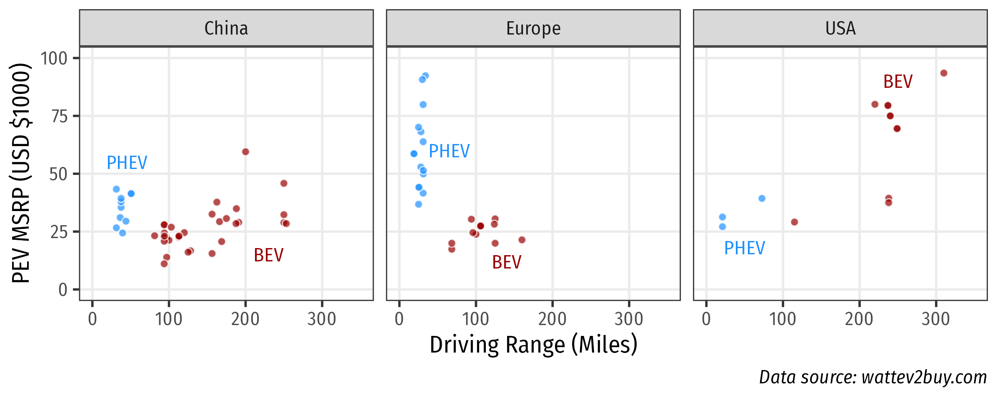
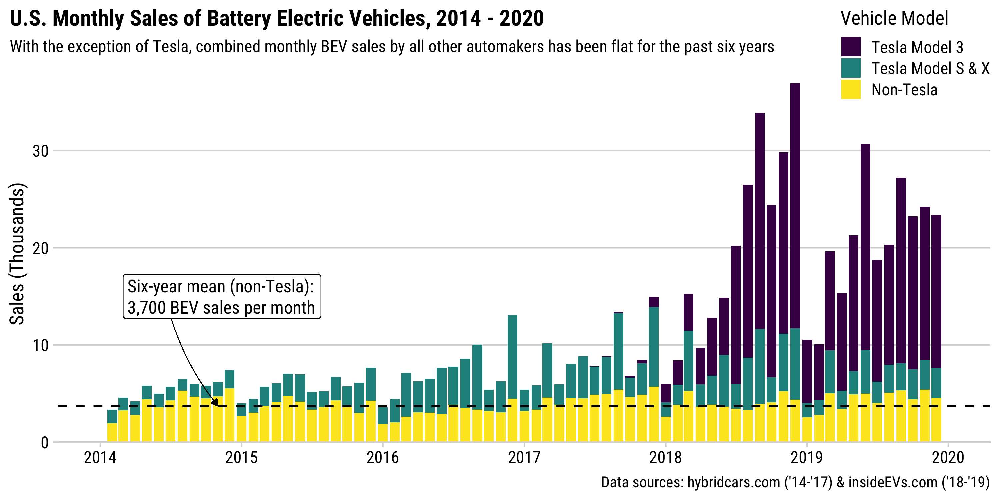

```{r setup, include=FALSE}
library(knitr)
library(fontawesome)
library(metathis)
library(kableExtra)
library(tidyverse)

options(
    htmltools.dir.version = FALSE,
    knitr.table.format = "html",
    knitr.kable.NA = '',
    dplyr.width = Inf,
    width = 250
)
knitr::opts_chunk$set(
    warning = FALSE,
    message = FALSE,
    fig.path = "figs/",
    fig.width = 7.252,
    fig.height = 4,
    comment = "#>",
    fig.retina = 3
)

# Setup xaringanExtra options
xaringanExtra::use_xaringan_extra(c(
  "tile_view", "panelset", "share_again"))
xaringanExtra::style_share_again(share_buttons = "none")
xaringanExtra::use_extra_styles(
  hover_code_line = TRUE,
  mute_unhighlighted_code = FALSE
)

# Set up website metadata
meta() %>%
  meta_general(
    description = rmarkdown::metadata$subtitle,
    generator = "xaringan and remark.js"
  ) %>%
  meta_name("github-repo" = "jhelvy/slides/2024-isa-conf-china-ev") %>%
  meta_social(
    title = rmarkdown::metadata$title,
    url = "https://slides.jhelvy.com",
    og_type = "website",
    og_author = "John Paul Helveston",
    twitter_card_type = "summary_large_image",
    twitter_creator = "@johnhelveston"
  )
```

name: title-slide
class: inverse, middle
background-size: contain
background-image: url(images/china.png)

.leftcol20[

<center>
<br>

</center>

]

.rightcol80[

## `r rmarkdown::metadata$title`

<br>

### `r rmarkdown::metadata$author`

### `r rmarkdown::metadata$institute`

### `r rmarkdown::metadata$date`

]

---

class: inverse

# China's PEV Ambition

<br>

## - Energy Security
## - Pollution Reduction
## - Technology Leadership

---

background-color: #FFF
class: middle

.leftcol35[

# China's PEV Ambition

<br>

### - .green[Energy Security]
### - Pollution Reduction
### - Technology Leadership

]

.rightcol65[

<center>

</center>

.right[Data source: U.S. EIA: https://www.eia.gov/petroleum/data.phpii]

]

---

background-color: #FFF
class: middle

.leftcol35[

# China's PEV Ambition

<br>

### - Energy Security
### - .green[Pollution Reduction]
### - Technology Leadership

]

.rightcol65[

<center>

</center>

.right[Data source: https://www.globalcarbonatlas.org]

]

---

background-color: #FFF
class: middle

.leftcol35[

# China's PEV Ambition

<br>

### - Energy Security
### - Pollution Reduction
### - .green[Technology Leadership]

]

.rightcol65[

<center>

</center>

]

---

name: sales
class: center, middle
background-color: #FFF

# More than half of global PEV sales are in China

<center>

</center>

---

class: inverse, middle, center

# Institutions

# Market Conditions 

# Policies

---

class: inverse, middle, center

.leftcol[

# .orange[Institutions]

# Market Conditions 

# Policies

]

.rightcol[

<br>

## 1) The Joint Venture System

## 2) Local Protectionism 

]

---

class: center

# The Chinese Joint Venture System

## 1980s: 以市场换技术 = “Exchange market for technology”

--

<center>

</center>

???

Past research suggests system has largely failed to transfer technology

(Brandt & Thun, 2010; Feng, 2010; Howell, 2016; Huang, 2003; Lazonick & Li, 2012; Nam, 2011)

---

class: inverse, middle, center

### “这就像吸食鸦片一样，一旦你沾染上了就永远也无法戒掉。”

何光远, 中国前机械工业部部长

<br>

### “It's like opium. Once you've had it you will be addicted forever.”

Guangyuan He, Former Minister of Machinery and Industry (Reuters, 2012)

---

class: center 

## JV system creates disincentives for<br>industry incumbents to innovate

<br>

.leftcol[

### Multinational OEMs lack incentives to bring cutting-edge technologies

]

.rightcol[

### Chinese JV partners lack incentives to independently innovate

]

---

background-color: #FFF
class: middle, center

### While MNEs dominate global vehicle markets,<br>Chinese firms sell most PEVs in China

<center>

</center>

---

background-color: #FFF
class: middle, center

### While MNEs dominate global vehicle markets,<br>Chinese firms sell most PEVs in China

<center>

</center>

---

background-color: #FFF
class: middle, center

## JV requirement dropped for PEVs in 2018 -> Tesla entry

--

<center>

</center>

---

class: center, center, middle

# Local protectionism incubated early<br>(and continuing) experimentation

---

class: inverse, middle, center

.leftcol[

# Institutions

# .orange[Market Conditions]

# Policies

]

--

.rightcol[

<br>

.left[

## 1) Lower bar for selling PEVs

## 2) Infrastructure 

]]

---

class: center

## Chinese buyers are more willing to adopt BEVs

.leftcol65[

<center>

</center>

]

.rightcol35[

<br><br><br><br><br>

.left[.font80[Helveston et al. (2015) "Will subsidies drive electric vehicle adoption? Measuring consumer preferences in the U.S. and China" _Transportation Research Part A: Policy and Practice_. 73, 96–112. DOI: [10.1016/j.tra.2015.01.002](https://www.sciencedirect.com/science/article/abs/pii/S0965856415000038)]]

]

---

class: center, middle 

### Chinese buyers are willing to accept relatively lower BEV driving ranges

<center>

</center>

---

# .center[Infrastructure]
 
<br>

--

.leftcol[

### .center[World's largest charging network]

- China has >1M EV chargers, ~40% fast chargers.
- **112,000 chargers installed in December 2020 alone**.

]

--

.rightcol[

### .center[World's largest HSR network]

- China's high-speed rail network greater than length of the equator (40,000 km).

]

---

class: inverse, middle, center

.leftcol[

# Institutions

# Market Conditions

# .orange[Policies]

]

--

.rightcol[

<br>
<br>

## Bigger Sticks & Carrots

]

---

.leftcol[

## .center[Consumers]

- **Purchase Subsidies**:
    - RMB 50,000 (USD $8,200) for PHEVs
    - RMB 60,000 (USD $9,800) for BEVs
- **PEV exemptions from restrictions**
    - Shanghai license plates auction for ~$15,000 (free for PEVs)
    - Unlimited driving during "Rush Hour" (7am – 8pm)

]

--

.rightcol[

## .center[OEMs]

- **Dual Credit System**: require annual credits for meeting fuel economy standards & selling PEVs.
- Tesla earned $1.58 billion from credit sales in 2020<br>(.green[$721 million] profit would have been .red[-$859 million] loss).

]

---

class: middle, center, inverse

# Policies that make ICEVs more expensive<br>than PEVs increase PEV adoption

---

class: inverse, middle

# .center[China's PEV Industry now<br>central target in US-China Trade War]

---

### May 14, 2024: Biden admin releases 100% tariff on Chinese-made EVs

<br>

### Summary of [Justification from the Whitehouse](https://www.whitehouse.gov/briefing-room/statements-releases/2024/05/14/fact-sheet-president-biden-takes-action-to-protect-american-workers-and-businesses-from-chinas-unfair-trade-practices/):

- China uses "unfair trade practices" to achieve artificially low prices. 
- China has "overcapacity" in EV production due to "non-market practices".
- China's global exports of EVs grew by 70% from 2022 to 2023.
- Therefore, high tariffs are needed to protect US auto.

> "We can’t let China’s EV overcapacity problem turn into a U.S. auto industry problem"<br>- Joe Biden, May 14, 2024

---

background-color: #FFF
class: middle

.leftcol80[

<center>

</center>

]

.rightcol20[

### China's real overcapacity problem:<br>**ICE cars**

]

---

class: inverse

.leftcol80[

<center>

</center>

]

.rightcol20[

### Recent surge driven by ICE exports to Russia

<br>[Source](https://x.com/gdp1985/status/1795562850678710700)

]

---

background-color: #FFF

## China EV exports driven by Tesla & BYD 

```{r china-exports, echo=FALSE}
htmltools::tags$iframe(
  src         = file.path('images', 'china-exports.html'),
  width       = "80%",
  height      = "550",
  scrolling   = "no",
  seamless    = "seamless",
  frameBorder = "0"
)
```

Source: https://www.csis.org/analysis/electric-shock-interpreting-chinas-electric-vehicle-export-boom

---

name: final
class: inverse
background-size: contain
background-image: url(images/china.png)

<br><br><br>

## .center[Slides available at [https://slides.jhelvy.com/](https://slides.jhelvy.com/)]

### .center[© 2024 John Paul Helveston]

.footer-large[
.right[

@johnhelveston `r fa(name = "twitter", fill = "white")`<br>
@jhelvy `r fa(name = "github", fill = "white")`<br>
@jhelvy `r fa(name = "weixin", fill = "white")`<br>
jhelvy.com `r fa(name = "link", fill = "white")`<br>
jph@gwu.edu `r fa(name = "paper-plane", fill = "white")`

]]

---

class: center, middle, inverse 

# Extra slides

---

background-color: #FFF
class: center

## Chinese automakers offer a greater variety of PEVs<br>at more affordable prices and driving ranges

<center>

</center>

---

background-color: #FFF
class: middle, center

<center>

</center>
