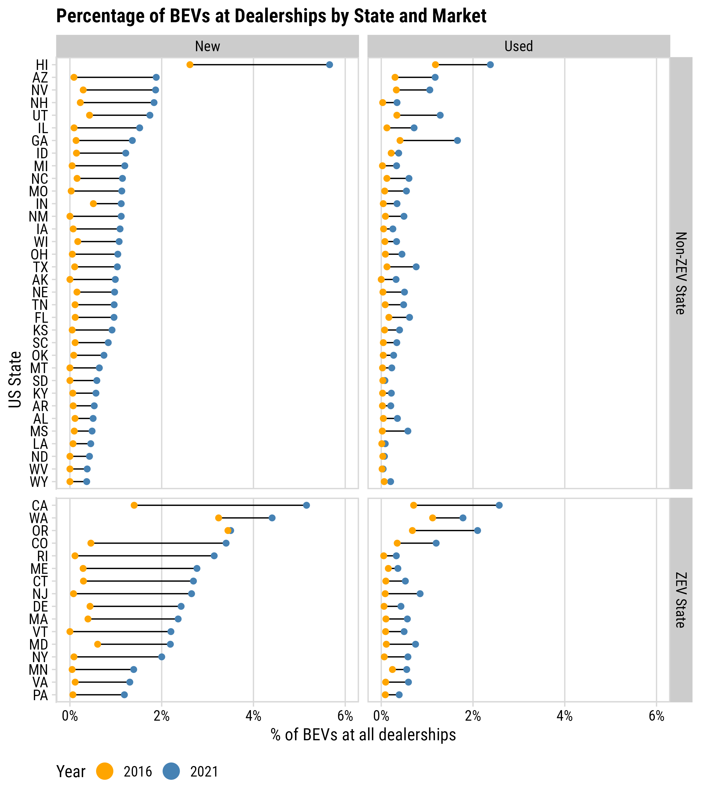
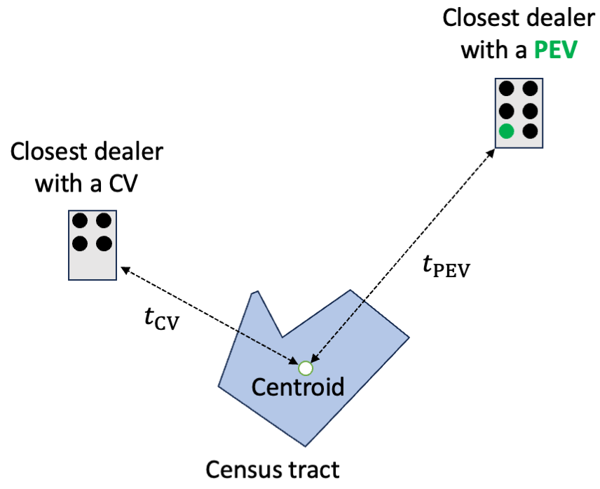
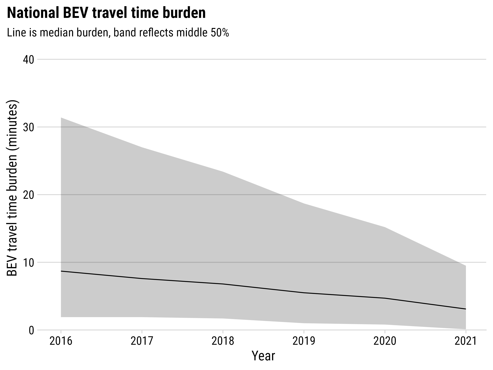
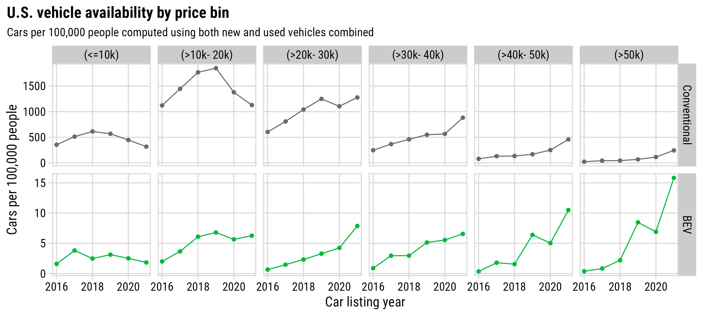
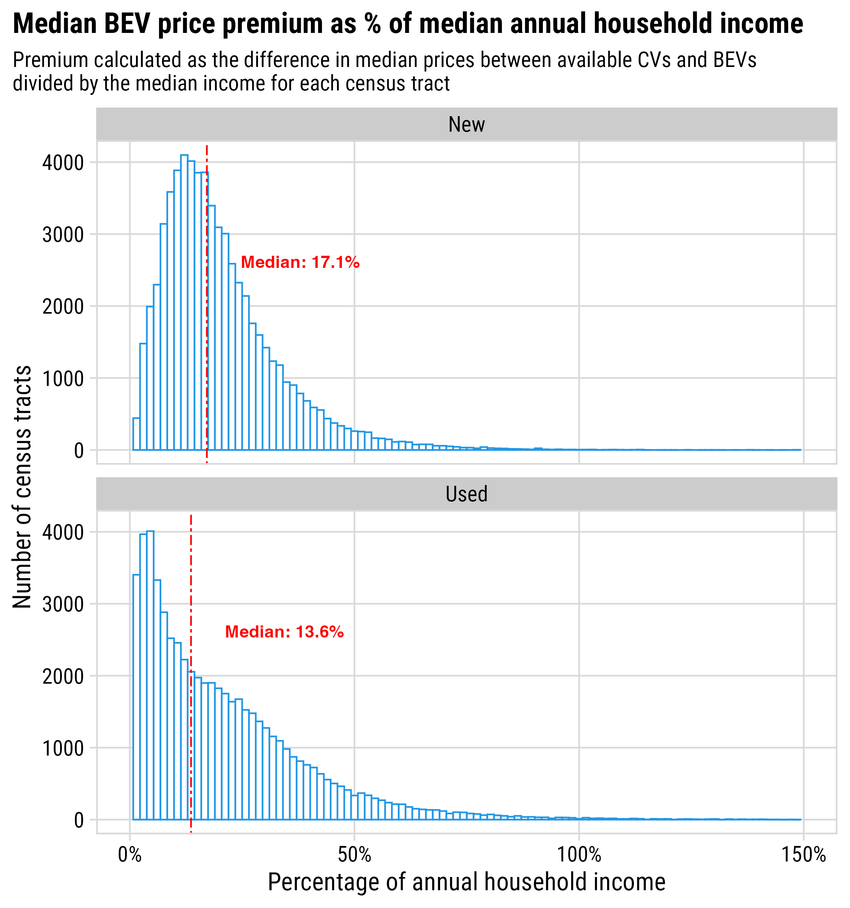
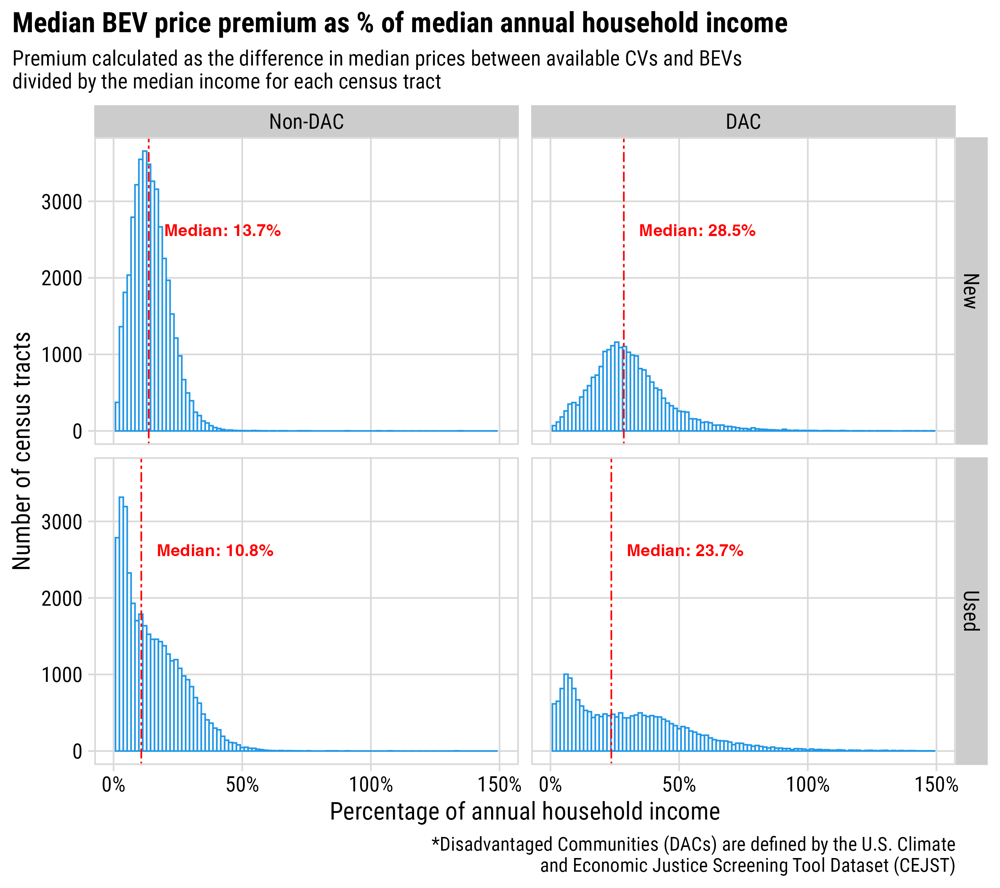
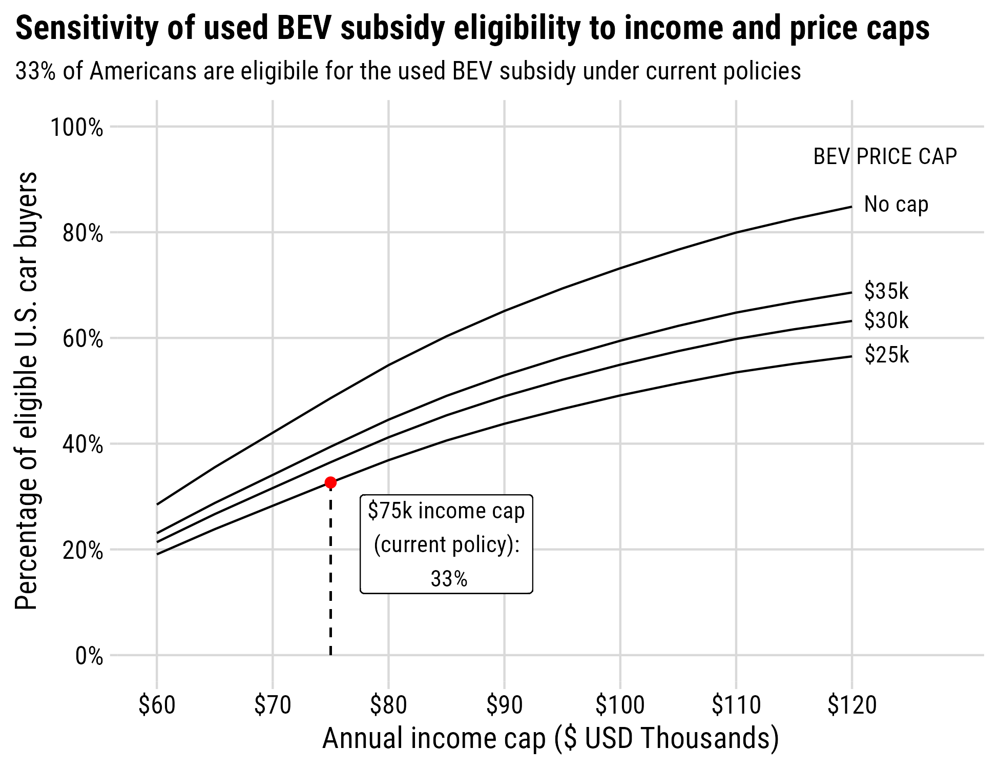
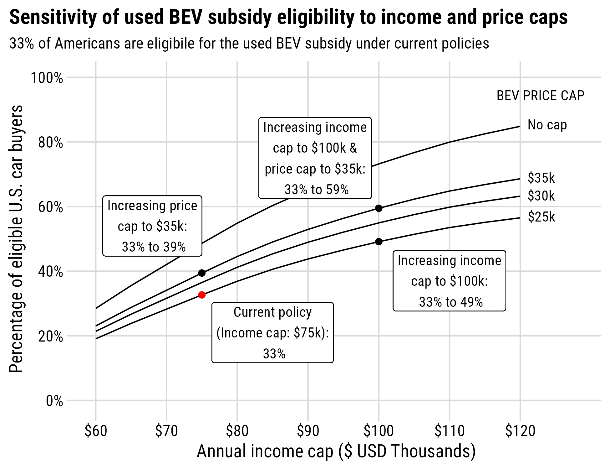
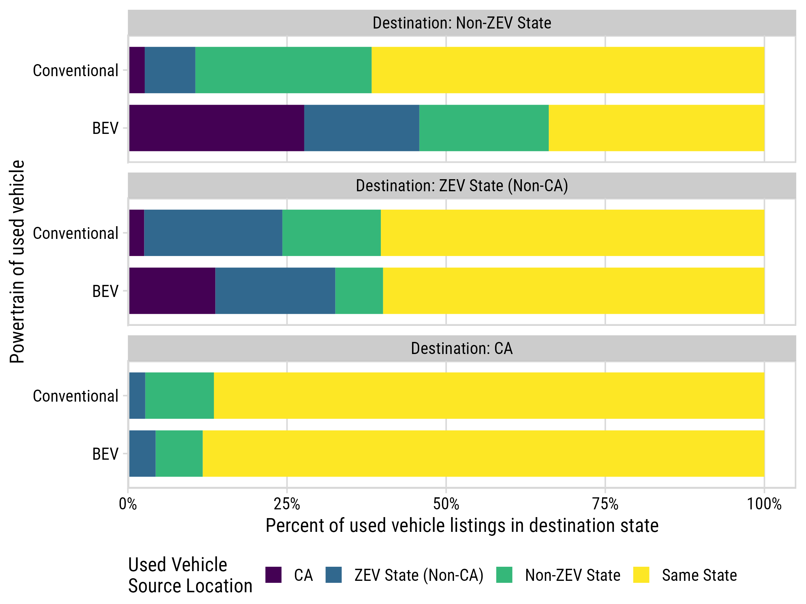

```{r setup, include=FALSE}
library(knitr)
library(fontawesome)
library(tidyverse)
library(metathis)
library(kableExtra)
library(here)

options(
    htmltools.dir.version = FALSE,
    knitr.table.format = "html",
    knitr.kable.NA = '',
    dplyr.width = Inf,
    width = 250
)
knitr::opts_chunk$set(
    warning = FALSE,
    message = FALSE,
    fig.path = "figs/",
    fig.width = 7.252,
    fig.height = 4,
    comment = "#>",
    fig.retina = 3
)

# Setup xaringanExtra options
xaringanExtra::use_xaringan_extra(c(
  "tile_view", "panelset", "share_again"))
xaringanExtra::style_share_again(share_buttons = "none")
xaringanExtra::use_extra_styles(
  hover_code_line = TRUE,
  mute_unhighlighted_code = FALSE
)

# Set up website metadata
meta() %>%
  meta_general(
    description = rmarkdown::metadata$subtitle,
    generator = "xaringan and remark.js"
  ) %>%
  meta_name("github-repo" = "jhelvy/slides") %>%
  meta_social(
    title = rmarkdown::metadata$title,
    url = "https://slides.jhelvy.com",
    og_type = "website",
    og_author = "John Paul Helveston",
    twitter_card_type = "summary_large_image",
    twitter_creator = "@johnhelveston"
  )

# Vehicle listings summary table
summary_dt_raw <- read_csv(here('data', 'listings_summary.csv'))
total_listings <- sum(summary_dt_raw$n) / 10^6
summary_dt <- summary_dt_raw %>% 
    mutate(
        n = scales::comma(n), 
        vehicle_type = ifelse(vehicle_type == 'car', 'Car', 'SUV')
    ) %>% 
    pivot_wider(
        names_from = powertrain,
        values_from = n
    ) %>% 
    select(
        Type = vehicle_type,
        Conventional = conventional, 
        Hybrid = hybrid, 
        PHEV = phev, 
        BEV = bev, 
        inventory_type
    ) %>% 
    mutate(PHEV = ifelse(is.na(PHEV), 0, PHEV)) %>% 
    rename(CV = Conventional, HEV = Hybrid)
```

background-image: url("images/blue.jpg")
background-size: cover
class: inverse

<br><br><br><br>

## `r rmarkdown::metadata$title`

**.white[John Paul Helveston]**, George Washington University<br>
Zain Hoda, George Washington University<br>
Daniel Fisher, George Washington University<br>
Lujin Zhao, George Washington University<br>

`r rmarkdown::metadata$date`

---

class: middle, center

## Addressing the **“innovation-needs paradox”**:

## The people most likely to benefit from a technology<br>are often the last ones to adopt it.

---

class: center
background-color: #fff

### .center[**Data**: `r round(total_listings, 1)`M vehicle listings from ~60k dealerships (marketcheck.com)<br>(2016 - 2021, inclusive)]

#### New Vehicles

```{r}
#| echo: false

summary_dt %>%
    filter(inventory_type == 'new') %>% 
    select(-inventory_type) %>% 
    kbl() 
```

#### Used Vehicles

```{r}
#| echo: false

summary_dt %>%
    filter(inventory_type == 'used') %>% 
    select(-inventory_type) %>% 
    kbl() 
```

---

class: middle 

# .center[How accessible are BEVs?]
 
--

## .center[Availability]

.font120[

1) How many dealerships are carrying BEVs?

2) How hard is it to get to a BEV dealer?

]
 
<br>

--

## .center[Affordability]

.font120[

3) How affordable are BEVs?

4) How many people are eligible for the used PEV subsidy?

]

---

class: inverse, middle, center

# How many dealerships are carrying BEVs?

---

class: center, middle

.leftcol70[

<center>

</center>

]

.rightcol30[

## **~1 in 3** dealers carried a BEV in 2021 (nationally)

<br>

## Up from<br>**~1 in 10** in 2016

]

---

class: center, middle

## **New** BEV availability growing faster than **Used**

<center>

</center>

---

.leftcol55[

<center>

</center>

]

.rightcol45[.font120[

- BEV inventories still low at most dealerships
- Something of a "ZEV Effect" in new market
- Used market more diffuse

]]


---

class: inverse, middle, center

# How hard is it to get to a BEV dealer?

---

background-color: #fff

## “Access burden”: additional travel time to see a BEV

.leftcol[

#### Access burden:

1. Find closest CV and BEV dealerships from census tract centroid. 
2. Compute road travel time* to each dealership: $t_{\mathrm{PEV}}$ and $t_{\mathrm{CV}}$
3. Compute “Burden” as difference in travel time: $b = t_{\mathrm{PEV}} - t_{\mathrm{CV}}$

<br>

*Road travel times obtained using<br>Open Street Road Map (OSRM)

]

.rightcol[.border[

<center>

</center>

]]

---

class: center
background-image: url('images/travel_burden_map.png')
background-size: contain

### BEV access burden has improved over time, but large gaps remain

---

class: center, middle

.leftcol70[

<center>

</center>

]

.rightcol30[

### Nationally, BEV travel burden is declining, though large variation exists.

]

---

class: center, middle

.leftcol70[

<center>

</center>

]

.rightcol30[

### Largest disparities in BEV travel burden is in **rural** areas, but this is rapidly improving

]

---

.leftcol60[

<center>

</center>

]

.rightcol40[

### BEV travel burden still high for **affordable** BEVs in rural areas

]

---

class: inverse, middle, center

# How affordable are BEVs?

---

class: center

### Most BEV supply growth in higher-price segments<br>.font80[(and overall supply still quite low)]

<center>

</center>

---

## .center[What is the median BEV (car) price premium over CVs?]

<br>

.font120[

For each census tract:

- Obtain all BEV & CV car listings in a 2-hour isochrone.
- Compute median prices for each: $p_{\mathrm{BEV}}$ & $p_{\mathrm{CV}}$
- Compute median premium as difference: $p_{premium} = p_{\mathrm{BEV}} - p_{\mathrm{CV}}$
- Divide $p_{premium}$ by median annual income of census tract

]

---

class: center, middle

.leftcol65[

<center>

</center>

]

.rightcol35[

## Median BEV price premium is 25% of annual income

]

---

class: center

.leftcol60[

<center>

</center>

]

.rightcol40[

## BEV price premium is much higher for disadvantaged communities <br>(median of 40% of annual income)

]

---

class: inverse, middle, center

# How many people are eligible<br>for the used PEV subsidy?

---

# This is a hypothetical calculation

.font120[

- Used BEV subsidy was not available until 2024

]

--

# Some assumptions

.font120[

- We use all BEV listings from 2016 to 2021 (inclusive). 
- We filter for only BEVs 2 years of age (current policy)
- For each census tract, we count the population as "eligible" if:

    1. The median income is <= the income cap.
    2. The median used BEV price is <= price cap.

]

---

class: middle, center
background-color: #fff

<center>

</center>

---

class: middle, center
background-color: #fff

<center>

</center>

---

class: middle, center
background-color: #fff

<center>

</center>

---

class: middle, center
background-color: #fff

<center>

</center>

---

class: middle, center
background-color: #fff

<center>

</center>

---

class: middle
background-color: #fff

.leftcol70[

<center>

</center>

]

.rightcol30[.font110[

Eligible population could increase from<br>1/3 to 2/3 if:

- Increase price cap: $25k -> $35k
- Increase income cap: $75k -> $100k

]]

---

class: inverse 
background-image: url("images/blue.jpg")
background-size: cover

<br><br><br><br><br><br><br><br><br><br>

# Thanks!

### Slides:

### https://slides.jhelvy.com/2025-ev-policy-council/

.footer-large[.white[.right[

@jhelvy.bsky.social `r fa(name = "bluesky", fill = "white")`<br>
@jhelvy `r fa(name = "github", fill = "white")`<br>
jhelvy.com `r fa(name = "link", fill = "white")`<br>
jph@gwu.edu `r fa(name = "paper-plane", fill = "white")`

]]]

---

class: inverse, middle, center

# Extra slides

---

class: center
background-color: #fff

### Access burden is shrinking in magnitude and spatial variation

<center>

</center>

---

class: center, middle
background-color: #fff

<center>

</center>
