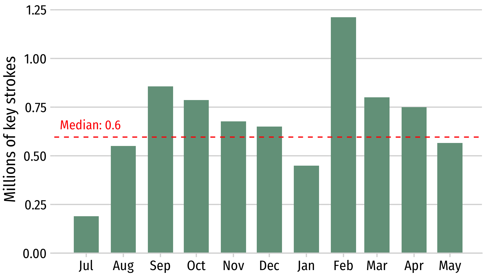

```{r setup, include=FALSE}
library(knitr)
library(fontawesome)
library(tidyverse)
library(metathis)
library(logitr)

options(
  htmltools.dir.version = FALSE,
  knitr.table.format = "html",
  knitr.kable.NA = '',
  dplyr.width = Inf,
  width = 250
)

knitr::opts_chunk$set(
  cache = FALSE,
  warning = FALSE,
  message = FALSE,
  fig.path = "figs/",
  fig.width = 7.252,
  fig.height = 4,
  comment = "#>",
  fig.retina = 3
)

# Setup xaringanExtra options
xaringanExtra::use_xaringan_extra(c(
  "tile_view", "panelset", "share_again"))
xaringanExtra::style_share_again(share_buttons = "none")
xaringanExtra::use_extra_styles(
  hover_code_line = TRUE,
  mute_unhighlighted_code = FALSE
)
xaringanExtra::use_broadcast()
xaringanExtra::use_freezeframe(responsive = FALSE)

knitr::opts_chunk$set(
    warning = FALSE,
    message = FALSE,
    comment = "#>",
    fig.path = "figs/",
    fig.retina = 3 # Better figure resolution
)
```

layout: true

<!-- this adds the link footer to all slides, depends on my-footer class in css-->

<div class="footer-small">
<span>
https://github.com/jhelvy/slides/2025-oscon-healthy-hands
</span>
</div>

---

name: title-slide
class: inverse, middle

# Healthier ❤️ & Happier 😄 Hands 🙌

.leftcol70[

## Software and Hardware Solutions for More Ergonomic Typing

### by John Paul Helveston

### 2025 OSCON @ GWU

]

.rightcol30[

<br><center>

</center>

]

---

class: center
background-color: #fff

## **I type ~7 million key strokes per year**

<center>

</center>

---

class: center
background-color: #fff

# **Tip #1**: Practice Touch Typing

## https://www.keybr.com/

<center>

</center>

---

class: center

# **Tip #2:** Use a text expander like _espanso_

<center>

</center>

See my post on espanso at <a href="https://www.jhelvy.com/blog">https://www.jhelvy.com/blog</a>
</center>

---

class: center

# **Tip #3:** Use custom keyboard layers

.cols3[

## .center[**Base layer**]

<center>
<p style="font-size:40px;">
1234567890
<br>
qwertyuiop
<br>
asdfgjhkl'
<br>
zxcvnm,./
</p>
</center>

]

.cols3[

<br>
<center>

</center>

]

.cols3[

## .center[**Shift layer**]

<center>
<p style="font-size:40px;">
!@#$%^&*()
<br>
QWERTYUIOP
<br>
ASDFGHJKL"
<br>
ZXCVBNM<>?
</p>
</center>

]

---

background-color: #fff
class: middle, center

# **Tip #3:** Use custom keyboard layers

<center>

</center>

---

background-color: #fff
class: center

# Example: **Caps Lock Layer**

<center>

</center>

---

class: center, middle

# **Tip #3:** Use custom keyboard layers

.leftcol[

# Mac 

#### https://karabiner-elements.pqrs.org/

<center>

</center>

]

.rightcol[

# Windows 

#### https://www.autohotkey.com/

<center>

</center>
]

---

background-color: #fff
class: center

# **Tip #4:** Use a split keyboard

<center>

</center>

---

background-color: #fff
class: center

# Reduce **Ulnar Deviation**

<center>

</center>

---

background-color: #fff
class: center

# Reduce **Forearm Pronation**

<center>

</center>

---

background-color: #fff
class: center, middle

# Think of your keyboard as a medical device

<br>

.cols3[

<center>

<br>
KINESIS Freestyle 2<br><b>$89.00</b>
</center>

]

.cols3[

<center>

<br>
Logitech - ERGO K860<br><b>$129.00</b>
</center>

]

.cols3[

<center>

Average cost of glasses<br><b>$242.00</b>
</center>

]

---

class: center

# Build Your Keyboard With Open Source Tools!

<center>

<br>
Iris (~$200.00), Powered by <a href="https://qmk.fm/">QMK Firmware</a>
</center>

---

background-color: #fff
class: center

# Use a split keyboard **_that is programmable_**

<center>

</center>

[r/ErgoMechKeyboards](https://www.reddit.com/r/ErgoMechKeyboards/)

---

class: inverse

.leftcol70[

### **Tip #1**: Practice Touch Typing

### **Tip #2:** Use a text expander like _espanso_

### **Tip #3:** Use custom keyboard layers

### **Tip #4:** Use a split keyboard

My Iris Keyboard:

]

.rightcol30[.right[

# .center[.font150[Thanks!]]

# .center[❤️ 😄 🙌]
<br><br><br>
@jhelvy.bsky.social `r fa(name = "bluesky", fill = "white")`<br>
@jhelvy `r fa(name = "github", fill = "white")`<br>
jhelvy.com `r fa(name = "link", fill = "white")`<br>
jph@gwu.edu `r fa(name = "paper-plane", fill = "white")`<br>
https://slides.jhelvy.com/
]]
