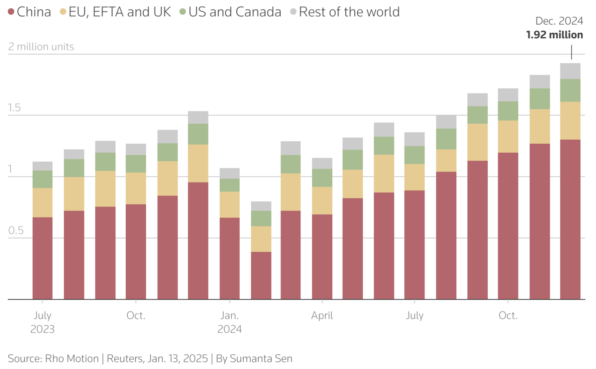
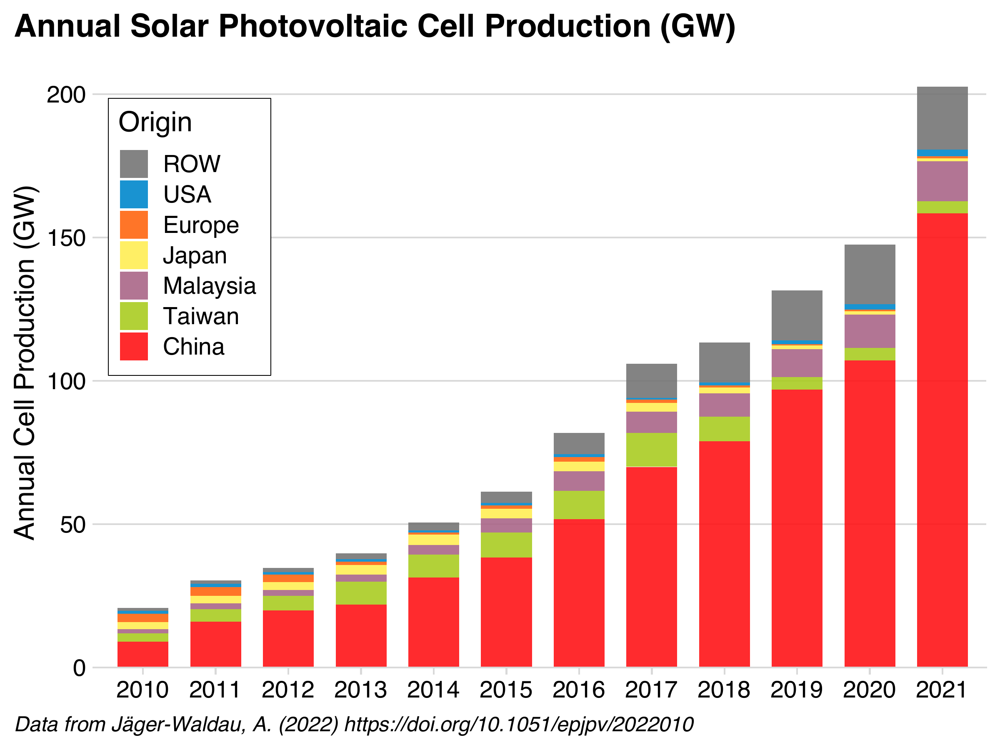
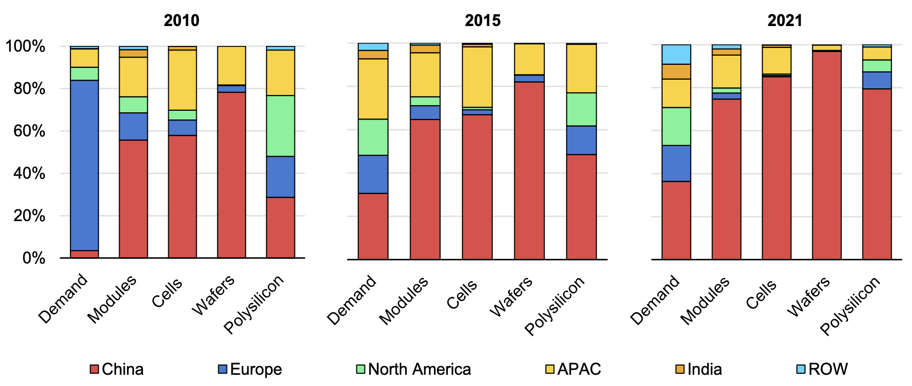
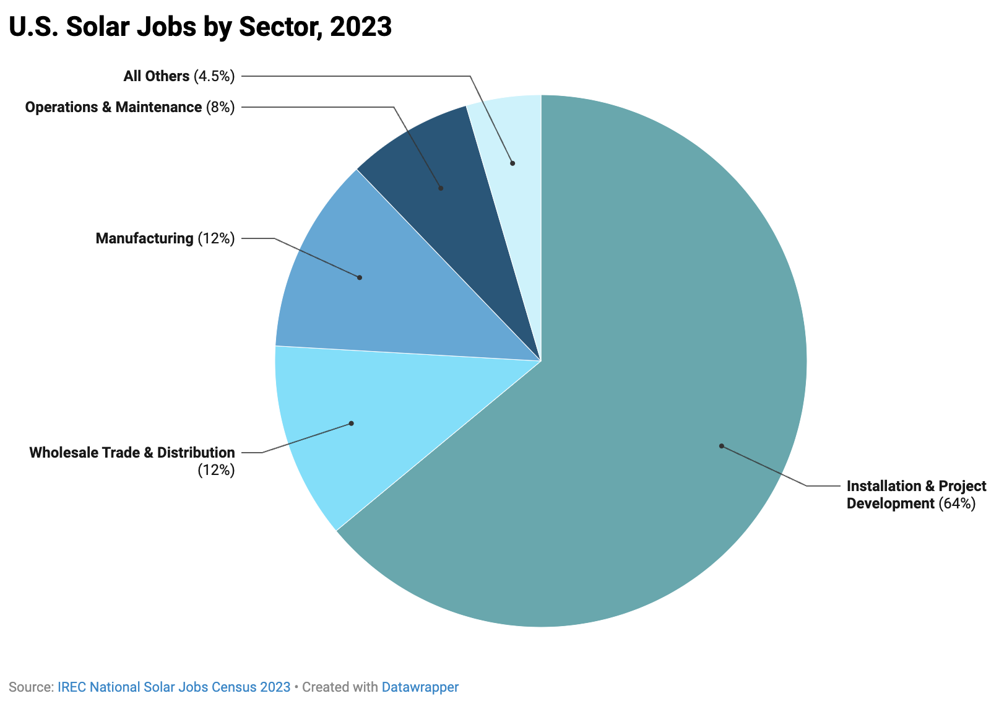
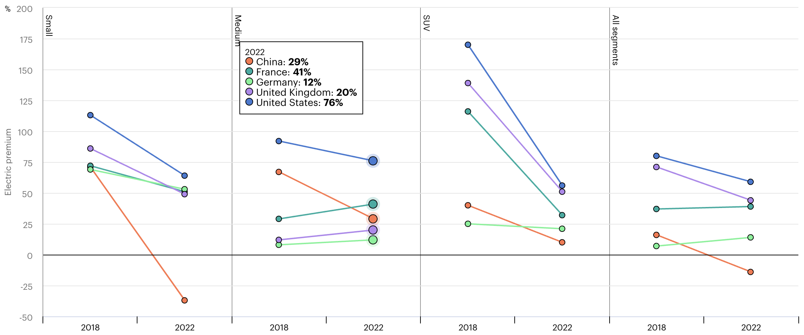
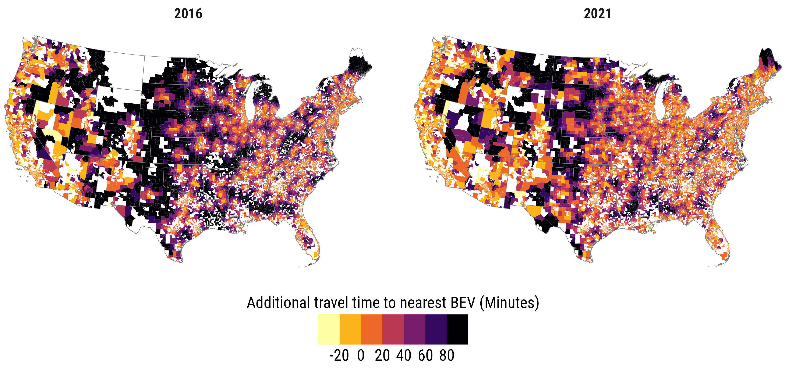

```{r setup, include=FALSE}
library(knitr)
library(fontawesome)
library(metathis)

options(
    htmltools.dir.version = FALSE,
    knitr.table.format = "html",
    knitr.kable.NA = '',
    dplyr.width = Inf,
    width = 250
)
knitr::opts_chunk$set(
    warning = FALSE,
    message = FALSE,
    fig.path = "figs/",
    fig.width = 7.252,
    fig.height = 4,
    comment = "#>",
    fig.retina = 3
)

# Setup xaringanExtra options
xaringanExtra::use_xaringan_extra(c(
  "tile_view", "panelset", "share_again"))
xaringanExtra::style_share_again(share_buttons = "none")
xaringanExtra::use_extra_styles(
  hover_code_line = TRUE,
  mute_unhighlighted_code = FALSE
)

# Set up website metadata
meta() %>%
  meta_general(
    description = rmarkdown::metadata$subtitle,
    generator = "xaringan and remark.js"
  ) %>%
  meta_name("github-repo" = "jhelvy/slides") %>%
  meta_social(
    title = rmarkdown::metadata$title,
    url = "https://slides.jhelvy.com",
    og_type = "website",
    og_author = "John Paul Helveston",
    twitter_card_type = "summary_large_image",
    twitter_creator = "@johnhelveston"
  )
```

background-image: url("images/blue.jpg")
background-size: cover
class: inverse

<br><br><br><br>

## `r rmarkdown::metadata$title`

**.white[John Paul Helveston]**, George Washington University

`r rmarkdown::metadata$date`

---

## .center[Chinese firms dominate EV and solar industries]

.leftcol[

#### .center[EV sales (Jul. '23 - Dec. '24)]

<center>

</center>

.font60[https://www.reuters.com/business/autos-transportation/global-electric-vehicle-sales-up-25-record-2024-2025-01-14/]

]

.rightcol[

#### .center[Solar module production ('10 - '21)]

<center>

</center>

.font60[Helveston, J.P., He, G., & Davidson, M.R. (2022) “Quantifying the cost savings of global solar photovoltaic supply chains” Nature.]

]

---

## .center[Chinese firms dominate EV and solar _supply chains_]

.leftcol[

#### .center[EV battery supply chain]

<center>

</center>

.font60[Cheng, Anthony L., et al. "Electric vehicle battery chemistry affects supply chain disruption vulnerabilities." Nature Communications 15.1 (2024): 2143.]

]

.rightcol[

#### .center[Solar module supply chain]

<center>

</center>

.font60[IEA Special report 2022: Solar PV Global Supply Chains, https://www.iea.org/reports/solar-pv-global-supply-chains]

]

---

# .center[**Bipartisan goal**: The US needs to counter China's lead in clean energy tech]

<br>

--

## **Keep Chinese clean tech out of US market**: Steep tariffs on imported Chinese EVs, batteries, PV modules

--

## **Keep Chinese firms out of US clean tech supply chains**: IRA restrictions on EV subsidy elligiblity, unclear guidance on Foreign Entities of Concern (FEOC) rules

---

# .center[Countering China & Investing in Manufacturing]

<br>

## **IRA Strategy**: Investing in *manufacturing* will lead to enduring support for clean tech through local jobs & economic benefits

--

## To what extent are counter-China policies helping or harming the clean tech manufacturing goal?

---

class: inverse, middle, center

# Solar PV

---

## Solar PV

### Total available U.S. federal subsidies: $0.16 / W

### Average U.S. module price (Q1 2024): $0.33 / W

<br><br><br><br>

Sources:

- https://www.nrel.gov/docs/fy24osti/91209.pdf
- Michael Davidson, “U.S.-China Clean Energy Race: Accelerating Innovation, Manufacturing and Adoption”, https://web.sas.upenn.edu/future-of-us-china-relations/climate-and-environment/

---

## Solar PV

### Total available U.S. federal subsidies: $0.16 / W

### Average U.S. module price (Q1 2024): $0.33 / W

### Average cost of production in China: **$0.10 / W**

<br><br>

Sources:

- https://www.nrel.gov/docs/fy24osti/91209.pdf
- Michael Davidson, “U.S.-China Clean Energy Race: Accelerating Innovation, Manufacturing and Adoption”, https://web.sas.upenn.edu/future-of-us-china-relations/climate-and-environment/

---

## Solar PV

### Total available U.S. federal subsidies: $0.16 / W

### Average U.S. module price (Q1 2024): $0.33 / W

### Average cost of production in China: $0.10 / W

### **Risk**: U.S. producers may not be globally competitive

Sources:

- https://www.nrel.gov/docs/fy24osti/91209.pdf
- Michael Davidson, “U.S.-China Clean Energy Race: Accelerating Innovation, Manufacturing and Adoption”, https://web.sas.upenn.edu/future-of-us-china-relations/climate-and-environment/

---

background-color: #fff

## Solar unlikely to produce desired # of manufacturing jobs

.leftcol70[

<center>

</center>

]

.rightcol30[

### Installation and project development accounts for 2/3 of solar jobs.

### Manufacturing is 12%

.footer[https://irecusa.org/census-solar-job-trends/]

]

---

# We need diversification

## China has enough solar PV capacity to meet annual global demand through 2032.

Source: Wood Mackenzie, https://www.reuters.com/world/china/china-will-dominate-solar-supply-chain-years-wood-mackenzie-2023-11-07/

--

<br>

## But do we need _onshoring_?

---

class: inverse, middle, center

# Electric Vehicles

---

background-color: #fff

<center>

</center>

---

background-color: #fff

## .center[EV sales in US reaching ~10% of sales]

<center>

</center>

.font80[Source: Argonne National Lab, https://www.anl.gov/ev-facts/model-sales]

---

class: center
background-color: #fff

## EV sector has an affordability problem (except in China)

.font70[Price gap between the sales-weighted average price of BEV and ICEV, before subsidy, by size, in 2018 and 2022]

<center>

</center>

.font70[Source: IEA, https://www.iea.org/reports/global-ev-outlook-2024/executive-summary]

---

.leftcol75[

<center>

</center>

.font60[Source: Roberson, Laura A., *Pantha, S., & Helveston, J.P. (2024) “Battery-Powered Bargains? Assessing Electric Vehicle Resale Value in the United States” Environmental Research Letters.]

]

.rightcol25[

### .center[Used market is more affordable, but post-COVID prices are up in all markets, not just EVs]

]

---

class: center
background-color: #fff

# There are still affordable EV deserts

<center>

</center>

---

# Things that don't help affordability:

<br>

--

## 100% tariff on imported Chinese EVs 

--

## Effectively banning the use of Chinese suppliers (inc. raw materials) in US EVs

--

## Inflation

---

## Chinese FDI into U.S.

### **Gotion batteries**: Multi-billion dollar investments in Illinois and Michigan

### Challenge: Uncertainty around Foreign Entities of Concern (FEOC) status

--

<br>

## Technology Licensing Agreements

### **Ford-CATL**: Licensing battery technology in a Michigan plant

### Challenge: CATL was recently added to DOD's list of “Chinese military companies”

---

class: middle, center, inverse

# The biggest competitor to an EV<br>is not a Chinese EV,<br>it's gas cars

---

class: inverse 
background-image: url("images/blue.jpg")
background-size: cover

<br>

# Thanks!

<br>

### slides.jhelvy.com/2025-princeton-industrial-policy

.footer-large[.white[.right[

@jhelvy.bsky.social `r fa(name = "bluesky", fill = "white")`<br>
@jhelvy `r fa(name = "github", fill = "white")`<br>
jhelvy.com `r fa(name = "link", fill = "white")`<br>
jph@gwu.edu `r fa(name = "paper-plane", fill = "white")`

]]]
