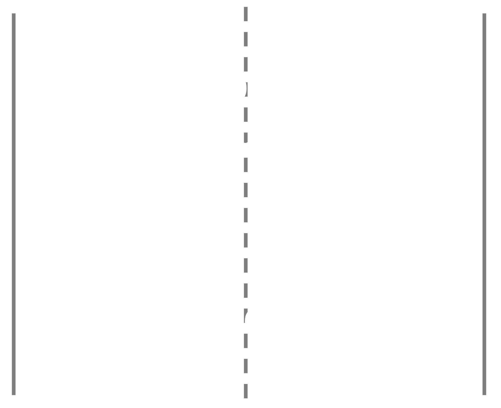
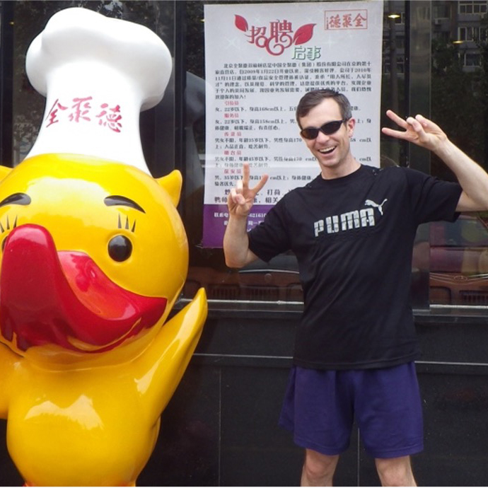
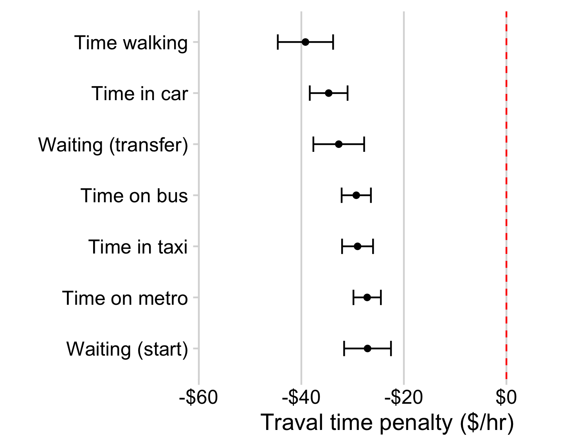
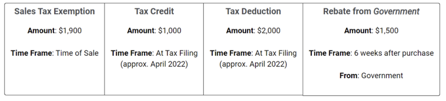
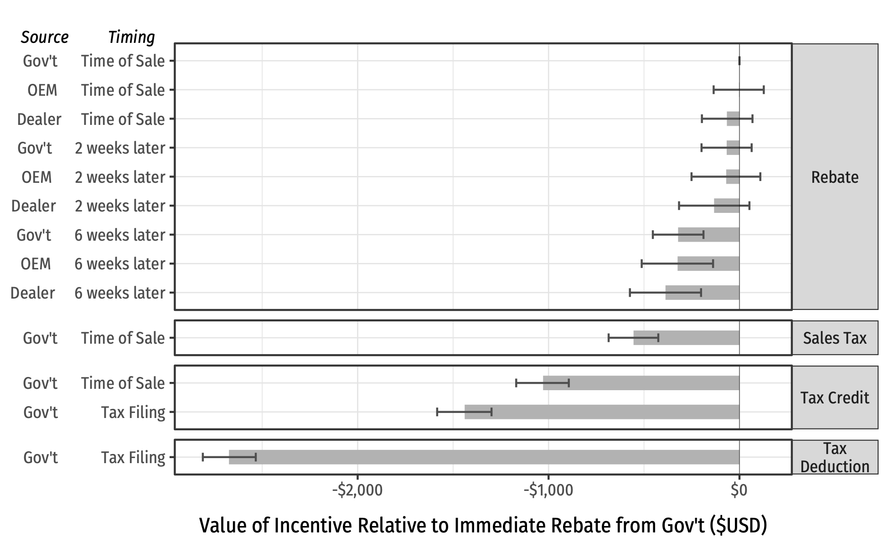
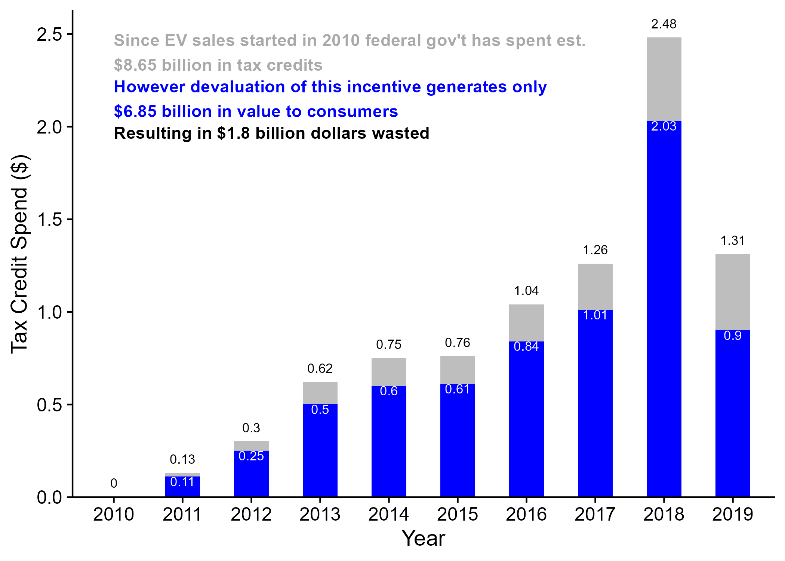
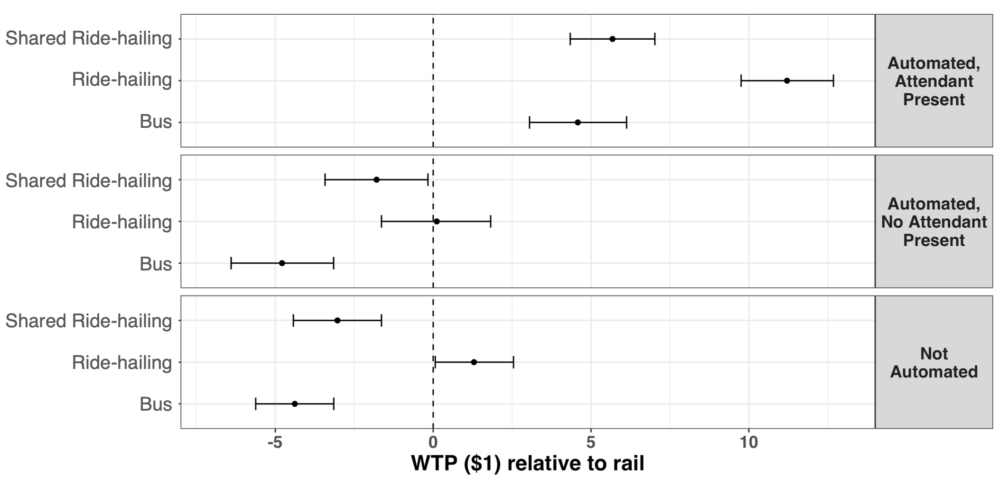

```{r setup, include=FALSE}
library(knitr)
library(tidyverse)
library(fontawesome)
library(metathis)

options(
  htmltools.dir.version = FALSE,
  knitr.table.format = "html",
  knitr.kable.NA = '',
  dplyr.width = Inf,
  width = 250
)

knitr::opts_chunk$set(
  cache = FALSE,
  warning = FALSE,
  message = FALSE,
  fig.path = "figs/",
  fig.width = 7.252,
  fig.height = 4,
  comment = "#>",
  fig.retina = 3
)

# Setup xaringanExtra options
xaringanExtra::use_xaringan_extra(c(
  "tile_view", "panelset", "clipboard", "share_again"))
xaringanExtra::style_share_again(share_buttons = "none")
xaringanExtra::use_extra_styles(
  hover_code_line = TRUE,
  mute_unhighlighted_code = FALSE
)

# Set up website metadata
meta() %>%
  meta_general(
    description = rmarkdown::metadata$subtitle,
    generator = "xaringan and remark.js"
  ) %>%
  meta_name("github-repo" = "jhelvy/intro") %>%
  meta_social(
    title = rmarkdown::metadata$title,
    url = "https://jhelvy.github.io/intro/",
    og_type = "website",
    og_author = "John Paul Helveston",
    twitter_card_type = "summary_large_image",
    twitter_creator = "@johnhelveston"
  )
```

class: middle, inverse

.leftcol40[
<center>

</center>
]

.rightcol60[
### `r fontawesome::fa(name = "user", fill = "white")` `r rmarkdown::metadata$author`
### `r fontawesome::fa(name = "university", fill = "white")` `r rmarkdown::metadata$institute`
### `r fontawesome::fa(name = "calendar-alt", fill = "white")` `r rmarkdown::metadata$date`
]

---

# Hello World!

.leftcol30[.circle[

]]
.rightcol70[

### John Paul Helveston, Ph.D.

.font80[
Assistant Professor, Engineering Management & Systems Engineering
Website: [www.jhelvy.com](http://www.jhelvy.com/)

- 2010 BS in Engineering Science & Mechanics at Virginia Tech
- 2015 MS in Engineering & Public Policy at Carnegie Mellon University
- 2016 PhD in Engineering & Public Policy at Carnegie Mellon University
- 2016-2018 Postdoc at [Institute for Sustainable Energy](https://www.bu.edu/ise/), Boston University
]]

---

class: center, middle

# Three random facts about me

--

.cols3[
### .center[I swing dance]
<center>

</center>
]

--

.cols3[
### .center[I worked in China]
<center>

</center>
]

--

.cols3[
### .center[I swing dance in China]
<center>

</center>
]

---

class: center, middle

# I use `r fontawesome::fa(name = "r-project", fill = "#276DC2")` for everything

<br>

--

### ...seriously...even [these slides](https://github.com/jhelvy/intro)

---

class: center, middle
 
.cols3[
### .center[[EMSE 4571:](https://p4a.seas.gwu.edu/)<br>Intro to Programming for Analytics<br>(Spring)]
<center>

</center>
]

--

.cols3[
### .center[[EMSE 4572:](https://eda.seas.gwu.edu/)<br>Exploratory Data Analysis<br>(Fall)]

<center>

</center>
]

--

.cols3[
### .center[[EMSE 6035:](https://madd.seas.gwu.edu/)<br>Marketing Analytics for Design Decisions<br>(Fall)]
<center>

</center>
]

---

class: center

## Technology Change Lab 

<center>

</center>

---

class: center

## Technology Change Lab 

> I study how consumers, firms, markets, and policies affect technology change to<br> facilitate transitions to sustainable and low-carbon technologies.

.cols3[
### .center[Electric & Sustainable Vehicle Technologies]
<center>

</center>
]

.cols3[
### .center[Market & Policy Analysis]
<center>

</center>
]

.cols3[
### .center[U.S. - China Climate Relationship]
<center>

</center>
]

---

## I'm interested in questions like...

<br>

--

### - How can we get people to buy more efficient vehicles?

--

### - How will emerging technology like autonomous and electric vehicles compete against existing technologies in the market?

--

### - Would people be willing to pay a premium to reduce pollution? 

--

## **Answers depend on knowing what people want**

---

background-color: #000
class: center, middle, inverse

# So I try to figure out what people want

<center>

</center>

---

class: center, middle 

## Which feature do you care more about?

<center>

</center>

.cols3[
## .center[Battery Life?]
<center>

</center>
]

.cols3[
## .center[Brand?]
<center>

</center>
]

.cols3[
## .center[Signal quality?]
<center>

</center>
]

---

class: center 

## Directly asking people what they want usually isn't helpful

--

## (People want everything)

<center>

</center>

---

class: center

## **Conjoint Analysis**:
## Use choice data to model preferences

<center>

</center>

---

### .center[Use random utility framework to predict probability of choosing phone _j_]

<br>

--

### 1. $u_j = \beta_1\mathrm{price}_j + \beta_2\mathrm{brand}_j + \beta_3\mathrm{battery}_j + \beta_4\mathrm{signal}_j + \varepsilon_j$

--

### 2. Assume $\varepsilon_j \sim$ iid Gumbel distribution

--

### 3. Probability of choosing phone _j_: $P_j = \frac{e^{\beta'x_j}}{\sum_k^J e^{\beta'x_k}}$

--

### 4. Estimate $\beta_1$, $\beta_2$, $\beta_3$, $\beta_4$ via maximum likelihood estimation 

---

class: center 

.leftcol[.center[
## **Willingness to Pay**

<br>

.font140[Respondents on average are willing to pay $XX to improve battery life by XX%]
]]

--

.rightcol[
## **Make predictions**

### $P_j = \frac{e^{\hat{\beta}'x_j}}{\sum_k^J e^{\hat{\beta}'x_k}}$

<center>

</center>
]

---

name: choose
class: middle, inverse, center

# Choose your own adventure

## [.red[Electric Vehicles]](#ev)
## [.orange[Low-carbon Fuels]](#fuel)
## [.yellow[Multi-modal Trips]](#modes)
## [.green[Autonomous Vehicles]](#av)
## [Electric Vehicle Incentives](#incentive)

---

name: ev
class: inverse

## Will subsidies drive electric vehicle adoption? Measuring consumer preferences in the U.S. and China

.leftcol[
Helveston, John P., CMU

Yimin Liu, Ford

Elea M. Feit, Drexel U.

Erica R.H. Fuchs, CMU

Erica Klampfl, Ford

Jeremy J. Michalek, CMU
]

.rightcol[
_Transportation Research Part A: Policy and Practice_, 73, 96–112. (2015)
DOI: 10.1016/j.tra.2015.01.002
]

---

<center>

</center>

---

class: middle

.leftcol35[
## Chinese car buyers may be more willing to adopt full electric vehicles than Americans.
]

.rightcol65[
<center>

</center>
]

---

class: middle, center, inverse

# [.green[Return to choices]](#choose)

---

name: fuel
class: inverse

## Choice at the Pump: Measuring Preferences for Lower-Carbon Combustion Fuels?

.leftcol[
John P. Helveston, GWU

Stephanie M. Seki, CMU

Jihoon Min, CMU

Evelyn Fairman, CMU

Arthur A. Boni, CMU

Jeremy J. Michalek, CMU

Inês M. L. Azevedo, CMU
]

.rightcol[
_Environmental Research Letters_, 14(8) (2019)
DOI: 10.1088/1748-9326/ab2bd2
]

---

background-color: #fff

<center>

</center>

---

## On average, respondents WTP $150/ton CO2 avoided

.leftcol75[
<center>

</center>
]

.rightcol25[
Example:

- 26 mpg car
- 12-gallon tank
- Gas: $3/gallon

**A WTP of $150/ton CO2 avoided means increasing fuel price by 45%!**
]

---

class: middle, center, inverse

# [.green[Return to choices]](#choose)

---

name: modes
class: inverse

## Measuring consumer preferences for multi-modal trips

<br>

John P. Helveston, Assistant Professor, EMSE

Lujin Zhao, Ph.D. Student, EMSE

Saurav Pantha, MS Alumni & Visiting Scholar, EMSE

---

<center>

</center>

---

class: center 

.leftcol[
## Value of time
<center>

</center>
]

.rightcol[
## Value of mode
<center>

</center>
]

---

class: center 

<br>

.leftcol[
<center>

</center>
]

.rightcol[
<center>

</center>
]

---

class: middle, center, inverse

# [.green[Return to choices]](#choose)

---

class: inverse

## Designing more efficient & equitable EV incentives

<br>

John P. Helveston, Assistant Professor, EMSE

Laura Roberson, Ph.D. Student, EMSE

---

name: incentive
class: middle, center

# Which incentive option would you prefer?

<center>

</center>

---

class: center 

### Immediate rebate is $1,200 more valuable than current federal tax credit

<center>

</center>

---

<center>

</center>

---

class: middle, center, inverse

# [.green[Return to choices]](#choose)

---

name: av
class: inverse

# Undercutting Transit?

## Exploring potential competition between autonomous vehicles and public transportation in the U.S.

<br>

John P. Helveston, Assistant Professor, EMSE

Leah Kaplan, Ph.D. Student, EMSE

---

class: middle, center

## Imagine you are going out for an evening leisure activity - <br> Which transportation option would you choose/

<center>

</center>

---

background-color: #fff
class: center

# AVs only preferred when attendant present

<center>

</center>

---

class: middle, center, inverse

# [.green[Return to choices]](#choose)

---

name: packages

.leftcol[
# .center[logitr]

<center>

</center>

Fast estimation of multinomial and mixed logit models in R with “Preference” space or “Willingness-to-pay” space utility parameterizations.

[https://jhelvy.github.io/logitr/](https://jhelvy.github.io/logitr/)
]

.rightcol[
# .center[conjointTools]

<center>

</center>

Tools for designing choice based conjoint survey experiments.

[https://jhelvy.github.io/conjointTools/](https://jhelvy.github.io/conjointTools/)
]

---

name: cars
class: middle, inverse 

# .center[Analyzing historical vehicle listings data]

.leftcol[

<center>

</center>

]

.rightcol[

- New and used cars from 2015-2019
- ~55,000 dealerships

Powertrain | Listings 
-----------|-----------
Gasoline   | 22,769,637
Hybrid | 749,460
Battery Electric (BEV) | 87,852
Plug-In Hybrid (PHEV) | 112,222

]

---

# .center[Estimating residual value of EVs]

.leftcol30[

John P. Helveston, Assistant Professor, EMSE

Laura Roberson, Ph.D. Student, EMSE

]

.rightcol70[

<center>

</center>

]

---

# .center[Where are the EVs?]

.leftcol30[

John P. Helveston, Assistant Professor, EMSE

Kazi Asifa, Undergraduate Student, EMSE

2019 study be Sierra Club found that 74% of dealerships are not selling EVs

]

.rightcol70[

<center>

</center>

]

---

### .center[EVs are disproportionately supplied to ZEV states]

<center>

</center>

---

background-color: #fff

## .center[Do EV owners drive as much as gasoline car owners?]

John P. Helveston, Assistant Professor, EMSE<br>
Eliese Ottinger, Undergraduate Student, EMSE

<center>

</center>

---

class: inverse

<br>

# .center[.font150[Thanks!]]

### .center[Slides: https://github.com/jhelvy/intro]

.footer-large[
.right[
@JohnHelveston `r fa(name = "twitter", fill = "white")`<br>
@jhelvy `r fa(name = "github", fill = "white")`<br>
@jhelvy `r fa(name = "weixin", fill = "white")`<br>
jhelvy.com `r fa(name = "link", fill = "white")`<br>
jph@gwu.edu `r fa(name = "paper-plane", fill = "white")`
]]
